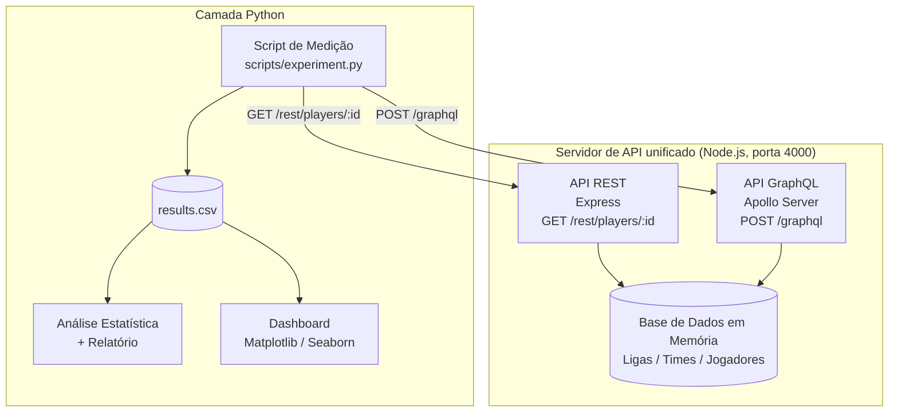
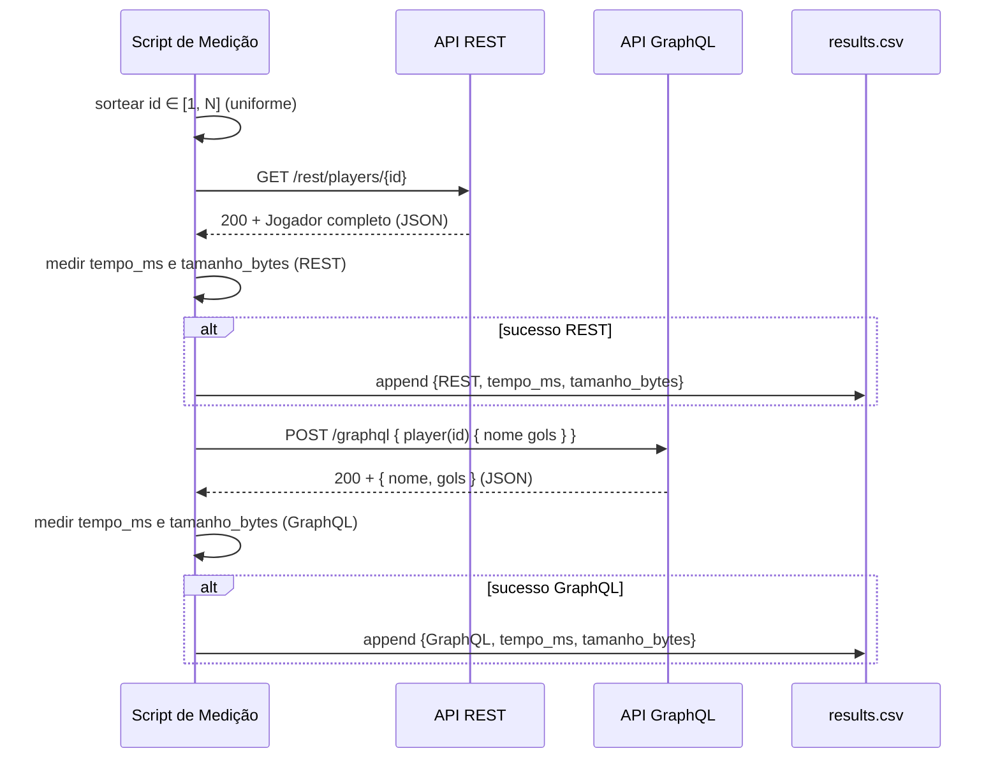

# Design Document

## Overview

Este documento descreve o desenho técnico do experimento controlado **LAB05**, que compara quantitativamente uma API GraphQL e uma API REST quanto a tempo de resposta (`Tempo_Ms`) e tamanho da resposta (`Tamanho_Bytes`), usando uma base de dados fictícia de estatísticas de futebol.

O sistema é composto por quatro subsistemas que se comunicam por contratos bem definidos:

1. **Servidor de API unificado (Node.js)** — um único processo que hospeda a API REST (Express) e a API GraphQL (Apollo Server) na porta 4000, ambas servidas a partir da mesma base de dados em memória.
2. **Base de dados em memória** — coleções de Ligas, Times e Jogadores, com IDs de Jogador contíguos de 1 a N e ao menos dez atributos estatísticos por Jogador.
3. **Script de medição (Python)** — executa iterações pareadas (mesmo ID de Jogador para REST e GraphQL), mede tempo e tamanho de cada resposta e grava `results.csv`.
4. **Análise e Dashboard (Python)** — lê `results.csv` com Pandas, calcula estatísticas descritivas, executa os testes de hipótese das RQ1/RQ2 e apresenta visualizações comparativas com Matplotlib e Seaborn.

O ponto central do desenho é evidenciar a diferença de payload: a API REST sempre retorna o Jogador completo (payload pesado), enquanto a API GraphQL retorna exclusivamente os campos solicitados na consulta (durante o experimento, apenas `nome` e `gols`). Essa assimetria intencional é o tratamento que o experimento mede.

### Mapeamento de Requisitos para Componentes

| Requisito | Componente principal |
|-----------|----------------------|
| R1 Desenho experimental | Script de medição + Documento de relatório |
| R2 Hipóteses | Módulo de análise estatística |
| R3 Base de dados | Módulo `database` (Node.js) |
| R4 API REST | Módulo `restApi` (Express) |
| R5 API GraphQL | Módulo `graphqlApi` (Apollo Server) |
| R6 Servidor unificado | Módulo `server` (bootstrap) |
| R7 Script de medição | `scripts/experiment.py` |
| R8 Armazenamento | `scripts/experiment.py` (writer CSV) |
| R9 Validação prévia | `scripts/experiment.py` (modo validação) |
| R10 Análise e relatório | Módulo de análise + relatório final |
| R11 Dashboard | Aplicação de visualização (Streamlit/Matplotlib/Seaborn) |

## Architecture

### Visão Geral



### Fluxo de uma Iteração Pareada



### Decisões de Arquitetura e Justificativas

- **Processo único hospedando ambas as APIs (R6.1):** garante que REST e GraphQL compartilhem o mesmo hardware, runtime, garbage collector e a mesma cópia da base em memória. Isso elimina diferenças ambientais como fator de confusão, fortalecendo a validade interna do experimento.
- **Base em memória, sem banco externo (R3.1):** remove latência de I/O de disco/rede de um banco como variável de confusão. O tempo medido reflete o custo de serialização e transporte, não o acesso a dados.
- **IDs contíguos de 1 a N (R3.4):** permite sorteio uniforme trivial (`randint(1, N)`) sem necessidade de manter uma lista de IDs válidos, e garante que todo ID sorteado corresponde a um Jogador existente.
- **Desenho pareado (R1.5):** usar o mesmo ID para os dois tratamentos na mesma iteração controla a variabilidade entre Jogadores (jogadores diferentes têm o mesmo tamanho de payload REST, mas o pareamento elimina qualquer viés de ordem de sorteio) e habilita testes estatísticos pareados, mais sensíveis.
- **GraphQL solicitando apenas `nome` e `gols` (R7.4):** materializa o cenário de payload otimizado, evidenciando a economia de tráfego do GraphQL frente ao REST completo.
- **Apollo Server + Express no mesmo app (R6.2):** Apollo Server integra-se como middleware do Express, permitindo expor `POST /graphql` e `GET /rest/players/:id` no mesmo listener da porta 4000.
- **Separação entre análise e dashboard:** a análise estatística (R10) produz números e decisões de hipótese reproduzíveis; o dashboard (R11) é uma camada de apresentação que consome os mesmos dados. Essa separação mantém a lógica de decisão testável independentemente da renderização.

### Stack Tecnológica

| Camada | Tecnologia |
|--------|-----------|
| Servidor | Node.js, Express, Apollo Server (`@apollo/server`), `graphql`, `cors` |
| Medição | Python 3.12+, `requests` (ou `httpx`), `csv`, `random`, `time` |
| Análise | Python, Pandas, SciPy (testes de hipótese), NumPy |
| Dashboard | Python, Pandas, Matplotlib, Seaborn (Streamlit como host opcional) |

## Components and Interfaces

### 1. Base de Dados em Memória (`database`)

Responsável por construir e expor as coleções de Ligas, Times e Jogadores. Construída uma única vez na inicialização do servidor.

```
buildDatabase() -> Database
  // Gera >= 2 Ligas, >= 5 Times, >= 50 Jogadores.
  // IDs de Jogador contíguos de 1..N.
  // Cada Jogador com >= 10 atributos estatísticos não negativos.

getPlayerById(db, id) -> Player | null
  // Retorna o Jogador com o id informado, ou null se não existir.

getPlayerCount(db) -> number
  // Retorna N (total de Jogadores) — usado por health checks/validação.
```

Invariantes garantidas:
- Todo Time referencia uma Liga existente; todo Jogador referencia um Time existente (R3.2).
- IDs de Jogador formam o conjunto `{1, 2, ..., N}` sem lacunas nem duplicatas (R3.3, R3.4).
- Todos os atributos estatísticos são numéricos e `>= 0` (R3.6).

### 2. API REST (`restApi`)

Roteador Express montado no servidor unificado.

```
GET /rest/players/:id
  200 -> Jogador completo em JSON (id, nome, todos os atributos estatísticos) (R4.1, R4.2, R4.5)
  400 -> { error: "<identificador inválido>" }  quando :id não é inteiro válido (R4.4)
  404 -> { error: "<jogador não encontrado>" }  quando :id válido mas inexistente (R4.3)
```

Regras:
- `:id` é considerado válido quando representa um inteiro positivo. Valores não inteiros (ex.: `abc`, `1.5`, vazio) resultam em 400.
- Respostas de erro nunca incluem dados de Jogador no corpo (R4.3, R4.4).
- `Content-Type: application/json` em todas as respostas (R4.5).

### 3. API GraphQL (`graphqlApi`)

Apollo Server montado em `POST /graphql`.

Schema (resumo):

```graphql
type League { id: Int!, name: String!, teams: [Team!]! }
type Team   { id: Int!, name: String!, league: League!, players: [Player!]! }

type Player {
  id: Int!
  nome: String!
  gols: Int!
  assistencias: Int!
  cartoesAmarelos: Int!
  cartoesVermelhos: Int!
  passesCertos: Int!
  desarmes: Int!
  kmPercorridos: Float!
  finalizacoesNoGol: Int!
  faltasCometidas: Int!
  defesas: Int!
  # ... (>= 10 atributos estatísticos no total)
}

type Query {
  player(id: Int!): Player        # R5.5
  league(id: Int!): League
  team(id: Int!): Team
}
```

Regras:
- Resolver de `player` retorna apenas os campos solicitados na consulta (comportamento nativo do GraphQL) (R5.1, R5.2).
- ID inexistente: campo `player` resolve para `null` e a resposta inclui um `errors` indicando "jogador não encontrado" (R5.3).
- Schema descreve Liga, Time e Jogador com >= 10 atributos no Jogador (R5.4).

Consulta usada pelo experimento:

```graphql
query($id: Int!) { player(id: $id) { nome gols } }
```

### 4. Servidor Unificado (`server`)

Bootstrap que monta REST e GraphQL no mesmo processo.

```
startServer(port = 4000) -> Promise<Server>
  // Constrói a base, monta Express + Apollo, habilita CORS (GET/POST),
  // escuta na porta 4000 e registra no console a confirmação de disponibilidade.
  // Em caso de porta ocupada (EADDRINUSE), registra erro descritivo e encerra.
```

Regras:
- CORS habilitado para métodos GET e POST, com cabeçalhos CORS nas respostas (R6.3).
- Log de confirmação em até 30s após inicialização (R6.4).
- Tratamento de `EADDRINUSE` com mensagem descritiva e `process.exit(1)` (R6.5).
- Health endpoints/consultas de teste respondem 200 (REST) e sem `errors` (GraphQL) (R9.1).

### 5. Script de Medição (`scripts/experiment.py`)

```
run_experiment(iterations=1000, mode="official") -> Summary
  // Para cada iteração:
  //   id = random.randint(1, N)        (R7.2, distribuição uniforme)
  //   mede REST  com o mesmo id        (R7.3, R7.5)
  //   mede GraphQL (nome, gols) mesmo id (R7.4, R7.5)
  //   grava registros bem-sucedidos    (R8.3)

measure_request(send_fn) -> Measurement
  // Retorna tempo_ms (envio -> corpo completo recebido) e
  // tamanho_bytes (len do corpo). Timeout de 30000 ms (R7.6).

is_failure(response) -> bool
  // True se erro de conexão, timeout, status >= 400, ou corpo com campo de erro (R7.7).
```

Modos de execução:
- **Validação (R9.2–R9.5):** 10 iterações; gera ~20 registros; se houver qualquer falha, interrompe antes da coleta oficial com mensagem descritiva; se zero falhas, habilita a coleta oficial.
- **Oficial (R7.1, R8.4):** 1000 iterações; produz entre 1800 e 2000 registros válidos.

Tratamento de falhas: requisições que falham são registradas (id + tratamento), a medição é descartada e a iteração prossegue (R7.7).

### 6. Writer de Resultados (CSV)

```
ResultsWriter(path="results.csv")
  write_header()                       # uma única linha de cabeçalho (R8.1)
  append(tecnologia, tempo_ms, tamanho_bytes)  # (R8.2, R8.3)
```

- Colunas, nesta ordem: `tecnologia` ∈ {`REST`, `GraphQL`}, `tempo_ms` (numérico), `tamanho_bytes` (inteiro) (R8.2).
- Falha de gravação de um registro é registrada, os registros já gravados são preservados e a execução prossegue (R8.5).

### 7. Análise Estatística e Relatório

```
load_results(path) -> DataFrame                      # R11.1 (Pandas)
descriptive_stats(df, treatment, metric) -> Stats    # count, mean, median, std, min, max (R10.1)
compare_treatments(df, metric) -> ComparisonResult
  // diferença de medianas, redução percentual,
  // teste unicaudal (Mann-Whitney / Wilcoxon), valor-p, decisão (R10.2, R10.3)
generate_report(results) -> Markdown                 # R10.5
```

- Nível de significância α = 0,05; rejeita H0 quando p < 0,05 (R2.5).
- Documenta ameaças à validade interna, externa, de construção e de conclusão (R10.4).
- Se não há registros válidos suficientes para uma RQ, documenta a ausência de dados (R10.6).

### 8. Dashboard de Visualização

```
render_dashboard(path="results.csv")
  // Lê CSV com Pandas; se ausente/ilegível -> mensagem de erro, sem gráficos (R11.5)
  // Se vazio -> mensagem "sem dados suficientes", sem gráficos (R11.6)
  // Caso contrário:
  //   - gráfico comparativo de tempo_ms (REST x GraphQL, mesmo gráfico) (R11.2)
  //   - gráfico comparativo de tamanho_bytes (REST x GraphQL, mesmo gráfico) (R11.3)
  //   - tabela de estatísticas (média, mediana, desvio padrão por tratamento) (R11.4)
```

## Data Models

### Player (Node.js / JSON)

```typescript
interface Player {
  id: number;                 // inteiro >= 1, único, contíguo 1..N
  nome: string;
  teamId: number;             // referência a um Team existente
  // >= 10 atributos estatísticos, todos numéricos e >= 0:
  gols: number;
  assistencias: number;
  cartoesAmarelos: number;
  cartoesVermelhos: number;
  passesCertos: number;
  desarmes: number;
  kmPercorridos: number;
  finalizacoesNoGol: number;
  faltasCometidas: number;
  defesas: number;
}
```

### Team / League

```typescript
interface Team   { id: number; name: string; leagueId: number; }   // leagueId referencia Liga existente
interface League { id: number; name: string; }
interface Database { leagues: League[]; teams: Team[]; players: Player[]; }
```

### Registro de Resultado (`results.csv`)

| Coluna | Tipo | Domínio |
|--------|------|---------|
| `tecnologia` | string | `REST` ou `GraphQL` |
| `tempo_ms` | número | >= 0 (milissegundos) |
| `tamanho_bytes` | inteiro | >= 0 (bytes) |

Exemplo:

```csv
tecnologia,tempo_ms,tamanho_bytes
REST,4.12,1843
GraphQL,2.07,41
```

### Modelos de Análise

```python
@dataclass
class Stats:
    count: int
    mean: float
    median: float
    std: float
    min: float
    max: float

@dataclass
class ComparisonResult:
    metric: str                 # "tempo_ms" | "tamanho_bytes"
    median_rest: float
    median_graphql: float
    median_diff: float          # rest - graphql
    pct_reduction: float        # (rest - graphql) / rest * 100
    p_value: float
    reject_null: bool           # p_value < 0.05
```

## Correctness Properties

*A property is a characteristic or behavior that should hold true across all valid executions of a system — essentially, a formal statement about what the system should do. Properties serve as the bridge between human-readable specifications and machine-verifiable correctness guarantees.*

As propriedades abaixo aplicam-se à camada de lógica pura do sistema: invariantes da base de dados, seleção de campos do GraphQL, regras de medição/decisão do script e serialização do CSV. Componentes de infraestrutura (wiring do servidor, CORS, porta), renderização de gráficos e conteúdo documental (declarações de desenho/hipóteses e relatório) são validados por testes de integração, smoke tests ou revisão documental, conforme a Testing Strategy.

### Property 1: Integridade estrutural da base de dados

*For any* base de dados construída por `buildDatabase`, ela contém ao menos 2 Ligas, ao menos 5 Times e ao menos 50 Jogadores; todo Time referencia uma Liga existente; todo Jogador referencia um Time existente; e o conjunto de identificadores de Jogador é exatamente `{1, 2, ..., N}`, sem lacunas nem duplicatas, onde N é o total de Jogadores.

**Validates: Requirements 3.1, 3.2, 3.4, 3.7**

### Property 2: Atributos estatísticos dos Jogadores

*For any* Jogador da base de dados, ele possui ao menos dez atributos estatísticos (incluindo gols, assistências, cartões amarelos, cartões vermelhos, passes certos, desarmes, quilômetros percorridos e finalizações no gol) e todo atributo estatístico é um valor numérico não negativo.

**Validates: Requirements 3.5, 3.6, 3.3**

### Property 3: REST retorna o Jogador completo para identificador existente

*For any* identificador no intervalo `[1, N]`, a resposta de `GET /rest/players/:id` tem status HTTP 200 e contém o identificador, o nome e todos os atributos estatísticos do Jogador correspondente exatamente como definidos na base de dados.

**Validates: Requirements 4.1, 4.2**

### Property 4: REST sinaliza erro sem dados de Jogador para identificadores não atendíveis

*For any* identificador que seja um inteiro fora do intervalo `[1, N]`, a resposta REST tem status 404; e *for any* identificador em formato inválido (não inteiro), a resposta REST tem status 400. Em ambos os casos, o corpo não inclui dados de Jogador e inclui uma mensagem de erro.

**Validates: Requirements 4.3, 4.4**

### Property 5: GraphQL retorna exclusivamente os campos solicitados

*For any* identificador de Jogador existente e *for any* subconjunto não vazio de campos do Jogador, a consulta GraphQL retorna um objeto cujo conjunto de chaves é exatamente o subconjunto solicitado, sem incluir nenhum atributo não solicitado.

**Validates: Requirements 5.1, 5.2**

### Property 6: GraphQL retorna Jogador nulo e erro para identificador inexistente

*For any* identificador que não corresponde a nenhum Jogador da base de dados, a resposta GraphQL tem o campo `player` nulo e inclui um campo de erro indicando que o Jogador não foi encontrado.

**Validates: Requirements 5.3**

### Property 7: Iteração pareada usa o mesmo identificador em ambos os tratamentos

*For any* iteração do script de medição, o identificador de Jogador aplicado à requisição REST é idêntico ao identificador aplicado à consulta GraphQL dentro daquela iteração.

**Validates: Requirements 1.5, 7.5**

### Property 8: Identificador sorteado pertence ao domínio válido

*For any* iteração do script de medição, o identificador de Jogador sorteado pertence ao intervalo `[1, N]`, onde N é a quantidade de Jogadores da base de dados.

**Validates: Requirements 7.2**

### Property 9: Classificação de falha de requisição

*For any* resultado de requisição, ele é classificado como falha se, e somente se, ocorreu erro de conexão, expiração de tempo limite (acima de 30000 ms), código de status HTTP maior ou igual a 400, ou a resposta contém campo de erro; e toda medição classificada como falha é descartada e não gera registro no arquivo de resultados.

**Validates: Requirements 7.7, 7.6**

### Property 10: Round-trip do arquivo de resultados

*For any* conjunto de registros de medição válidos, gravá-los no `results.csv` e relê-los com Pandas reproduz os mesmos registros, com as colunas `tecnologia`, `tempo_ms` e `tamanho_bytes` nessa ordem e uma única linha de cabeçalho.

**Validates: Requirements 8.1, 8.2, 8.3**

### Property 11: Corretude das estatísticas descritivas

*For any* conjunto não vazio de medições de um tratamento, as estatísticas descritivas calculadas satisfazem `min <= média <= max` e `min <= mediana <= max`, a contagem é igual ao número de registros considerados, os valores coincidem com uma implementação de referência (NumPy), e a redução percentual reportada entre tratamentos é igual a `(mediana_REST - mediana_GraphQL) / mediana_REST * 100`.

**Validates: Requirements 10.1, 10.2, 10.3**

### Property 12: Decisão das hipóteses pelo nível de significância

*For any* valor-p no intervalo `[0, 1]`, a decisão de rejeitar a Hipótese Nula (para RQ1 e RQ2) é verdadeira se, e somente se, o valor-p é menor que 0,05.

**Validates: Requirements 2.5**

### Property 13: Habilitação da coleta oficial após a validação

*For any* execução de validação, a coleta oficial de 1000 iterações é habilitada se, e somente se, o número de falhas de requisição registradas na validação é igual a zero; caso contrário, o fluxo é interrompido com uma mensagem de erro descritiva.

**Validates: Requirements 9.4, 9.5**

## Error Handling

### Servidor de API

| Cenário | Tratamento | Requisito |
|---------|-----------|-----------|
| REST: `:id` não inteiro | HTTP 400 + `{ error }`, sem dados de Jogador | R4.4 |
| REST: `:id` válido mas inexistente | HTTP 404 + `{ error }`, sem dados de Jogador | R4.3 |
| GraphQL: ID inexistente | `data.player = null` + `errors[]` | R5.3 |
| Porta 4000 ocupada (`EADDRINUSE`) | Log de erro descritivo + `process.exit(1)` | R6.5 |
| Erro interno não tratado | Middleware de erro do Express -> HTTP 500 JSON | R4.5 |

### Script de Medição

| Cenário | Tratamento | Requisito |
|---------|-----------|-----------|
| Erro de conexão | Registrar falha (id + tratamento), descartar medição, prosseguir | R7.7 |
| Timeout > 30000 ms | Classificar como falha por expiração, descartar, prosseguir | R7.6, R7.7 |
| Status >= 400 ou corpo com erro | Classificar como falha, descartar, prosseguir | R7.7 |
| Falha ao gravar registro no CSV | Registrar ocorrência, preservar registros já gravados, prosseguir | R8.5 |
| Validação com >= 1 falha | Interromper antes da coleta oficial + mensagem descritiva | R9.5 |

### Análise e Dashboard

| Cenário | Tratamento | Requisito |
|---------|-----------|-----------|
| Sem registros válidos suficientes para uma RQ | Documentar no relatório a ausência de dados | R10.6 |
| `results.csv` ausente/ilegível | Mensagem "dados não encontrados", não renderizar gráficos | R11.5 |
| `results.csv` sem registros | Mensagem "sem dados suficientes", não renderizar gráficos | R11.6 |

## Testing Strategy

A abordagem combina testes baseados em propriedades (para a lógica pura), testes de exemplo/edge cases (para contagens, formatos e bordas) e testes de integração/smoke (para wiring de infraestrutura e renderização). PBT é apropriado aqui porque há invariantes universais claras na base de dados, na seleção de campos do GraphQL, na classificação de falhas, na serialização CSV e nas regras de decisão estatística.

### Testes Baseados em Propriedades (PBT)

- **Node.js:** biblioteca `fast-check` (com Jest ou Vitest) para as Propriedades 1–6.
- **Python:** biblioteca `hypothesis` (com `pytest`) para as Propriedades 7–13.
- Cada teste de propriedade executa no mínimo **100 iterações**.
- Cada teste é anotado com um comentário referenciando a propriedade do design, no formato:
  `Feature: graphql-vs-rest-experiment, Property {número}: {texto da propriedade}`.
- Cada propriedade do design é implementada por **um único** teste baseado em propriedades.
- Não implementar PBT do zero — usar as bibliotecas indicadas.

Mapeamento propriedade -> camada de teste:

| Propriedade | Ferramenta | Alvo |
|-------------|-----------|------|
| P1, P2 | fast-check | `buildDatabase` / invariantes da base |
| P3, P4 | fast-check | resolver/handler REST (sobre a base em memória) |
| P5, P6 | fast-check | resolver GraphQL `player` (execução in-process do schema) |
| P7, P8, P9 | hypothesis | lógica de iteração e `is_failure` (com endpoints mockados) |
| P10 | hypothesis | `ResultsWriter` + `load_results` (round-trip) |
| P11 | hypothesis | `descriptive_stats` / `compare_treatments` |
| P12 | hypothesis | regra de decisão `reject_null` |
| P13 | hypothesis | regra de habilitação da coleta oficial |

### Testes de Exemplo e Edge Cases

- Contagens fixas: 1000 iterações oficiais (R7.1), 2000 registros planejados (R1.6), 10 iterações de validação (R9.2), ~20 registros de validação (R9.3), faixa 1800–2000 registros válidos com taxa de falha mockada (R8.4).
- Formato CSV: presença de cabeçalho único (R8.1).
- Caso `nome`+`gols` do GraphQL como exemplo dedicado (R5.2).
- Edge cases de robustez: timeout simulado (R7.6), falha de escrita preservando registros (R8.5), análise com dados insuficientes (R10.6), dashboard com CSV ausente/vazio (R11.5, R11.6).

### Testes de Integração e Smoke

- Subir o servidor unificado e atingir `GET /rest/players/:id` (200) e `POST /graphql` (sem `errors`) — health check (R9.1, R6.1).
- Verificar cabeçalhos CORS para GET/POST (R6.3).
- Inicialização: log de disponibilidade na porta 4000 em até 30s (R6.4); porta ocupada -> erro + encerramento (R6.5).
- Introspecção do schema GraphQL: entidades Liga/Time/Jogador, >=10 atributos e consulta `player(id)` (R5.4, R5.5).
- Medição real captura `tempo_ms` e `tamanho_bytes` com resposta mockada (R7.3, R7.4).
- Renderização do dashboard: ambos os tratamentos no mesmo gráfico de tempo (R11.2) e de tamanho (R11.3), e exibição das estatísticas por tratamento (R11.4).

### Verificação Documental

- Desenho experimental (R1.1–R1.4), hipóteses (R2.1–R2.4), ameaças à validade (R10.4) e relatório final (R10.5) são revisados como conteúdo documental no relatório do experimento.
