# Caracteristicas de Repositorios Populares do GitHub

**Laboratorio 1 — Relatorio Final (Sprint 3)**

| | |
|---|---|
| **Disciplina** | Laboratorio de Experimentacao de Software |
| **Autores** | Isaac Portela, Miguel Lessa |
| **Data de geracao** | 2026-03-12 UTC |
| **Amostra final** | 905 repositorios (de 1.000 buscados) |
| **Repositorio** | https://github.com/Miguel-Lessa/lab-medicao |

---

## 1. Introducao

### 1.1 Contextualizacao

O GitHub e a maior plataforma de hospedagem de codigo-fonte do mundo, com mais de 300 milhoes de repositorios publicos. Dentro desse universo, um pequeno subconjunto de projetos atinge niveis extraordinarios de popularidade, medida pelo numero de estrelas (stars) — um indicador de interesse e visibilidade da comunidade de desenvolvedores. Compreender **quais caracteristicas esses projetos compartilham** pode revelar padroes de sucesso em software open-source e fornecer insights valiosos para a engenharia de software empirica.

Este estudo se insere no contexto da disciplina de **Laboratorio de Experimentacao de Software**, aplicando metodologia cientifica a dados reais extraidos da API GraphQL do GitHub. Trata-se de um estudo **observacional** (mineracao de repositorios), onde nenhuma intervencao e realizada nos projetos analisados.

### 1.2 Problema foco do experimento

> *Quais sao as caracteristicas comuns dos repositorios mais populares do GitHub em termos de maturidade, atividade de desenvolvimento, contribuicao externa, praticas de release, distribuicao de linguagens e gestao de issues?*

O problema central e a falta de uma caracterizacao quantitativa e sistematica dos projetos mais estrelados do GitHub. Embora a popularidade (estrelas) seja um proxy amplamente utilizado para relevancia, nao esta claro se repositorios populares sao necessariamente maduros, ativos, bem mantidos ou escritos em linguagens especificas. Este experimento busca preencher essa lacuna.

### 1.3 Questoes de Pesquisa

| RQ | Pergunta | Metrica |
|---|---|---|
| RQ01 | Sistemas populares sao maduros/antigos? | Idade em anos (desde `createdAt`) |
| RQ02 | Recebem muita contribuicao externa? | Total de PRs aceitas (`MERGED`) |
| RQ03 | Lancam releases com frequencia? | Total de releases |
| RQ04 | Sao atualizados com frequencia? | Dias desde ultimo push (`pushedAt`) |
| RQ05 | Sao escritos nas linguagens mais populares? | Linguagem primaria (`primaryLanguage`) |
| RQ06 | Possuem alto percentual de issues fechadas? | Razao issues fechadas / total (%) |
| RQ07 | Linguagens populares concentram mais atividade? | RQ02–RQ04 segmentadas por linguagem |

### 1.4 Hipoteses

| # | H0 (Hipotese Nula) | H1 (Hipotese Alternativa) | Criterio de avaliacao |
|---|---|---|---|
| H1 | Repos populares NAO sao mais antigos que a media | Repos populares sao significativamente mais maduros | Mediana de idade > 5 anos |
| H2 | Repos populares NAO recebem mais PRs que a media | Recebem volume expressivo de contribuicoes externas | Mediana > 100 PRs aceitas |
| H3 | Repos populares NAO lancam mais releases | Usam o mecanismo de releases ativamente | Mediana > 10 releases |
| H4 | Repos populares NAO sao mais ativos que a media | Sao atualizados com alta frequencia | Mediana < 30 dias desde ultimo push |
| H5 | Linguagens populares NAO dominam o top 1000 | Linguagens populares concentram a maioria dos repos | Top 5 linguagens > 50% da amostra |
| H6 | Repos populares NAO fecham mais issues | Mantem alto percentual de issues fechadas | Mediana > 70% de issues fechadas |
| H7 | Nao ha diferenca entre linguagens | Linguagens populares apresentam metricas superiores | Variacao observavel entre ecossistemas |

### 1.5 Objetivos

**Objetivo principal:**
Caracterizar os repositorios mais estrelados do GitHub (busca inicial de 1.000, amostra final de 905 apos filtro de linguagem), identificando padroes de maturidade, atividade, contribuicao, releases e linguagens de programacao.

**Objetivos especificos:**
1. Avaliar se a popularidade esta associada a maturidade (tempo de existencia) dos projetos.
2. Quantificar o volume de contribuicao externa recebida (PRs aceitas).
3. Verificar a frequencia de lancamento de releases formais.
4. Medir a atividade recente de desenvolvimento (ultimo push).
5. Identificar as linguagens de programacao predominantes.
6. Avaliar a eficiencia na resolucao de issues.
7. Comparar metricas de atividade entre ecossistemas linguisticos (bonus).

---

## 2. Metodologia

### 2.1 Passo a passo do experimento

O experimento seguiu um pipeline automatizado em tres etapas:

**Etapa 1 — Configuracao do ambiente:**
- Criar arquivo `.env` com `GITHUB_TOKEN` (Personal Access Token com permissao de leitura).
- Instalar dependencias: `requests`, `python-dotenv`, `pandas`, `matplotlib`, `seaborn`, `scipy`, `numpy`.

**Etapa 2 — Coleta de dados (`coleta_sprint2.py`, ~5-10 min):**
1. Buscar os 1.000 repositorios mais estrelados via API GraphQL do GitHub, com paginacao de 100 repos por requisicao.
2. Filtrar *client-side* repositorios sem `primaryLanguage` definida (listas curadas, documentacao, datasets) — 95 descartados.
3. Enriquecer cada repositorio com metricas detalhadas (PRs, releases, issues) em lotes de 20 repos por query GraphQL.
4. Salvar dados brutos em `output/top_1000_repos.csv`.

**Etapa 3 — Analise e visualizacao (`analise_sprint3.py`, ~30s):**
1. Calcular estatisticas descritivas para cada RQ (mediana, media, DP, quartis, IQR).
2. Calcular correlacoes de Spearman entre variaveis numericas.
3. Gerar 13 graficos (histogramas, boxplots, barras, pizza, heatmap, scatter).
4. Gerar relatorio final em Markdown.

### 2.2 Decisoes de projeto

| Decisao | Justificativa |
|---|---|
| Usar `pushedAt` em vez de `updatedAt` | `pushedAt` reflete apenas pushes de codigo reais, excluindo atividades como comentarios em issues ou acoes de bots |
| Filtrar repos sem `primaryLanguage` | Excluir repos que nao sao projetos de software (listas curadas, documentacao, dados) |
| Usar mediana como medida central | Robusta a outliers, adequada para distribuicoes assimetricas com cauda longa |
| Usar correlacao de Spearman | Nao-parametrica, baseada em postos (rankings), robusta a outliers e nao exige normalidade |
| Nao remover outliers | Outliers representam projetos reais e relevantes; mediana ja minimiza seu impacto |
| Amostragem top-k (nao aleatoria) | O objetivo e caracterizar especificamente os projetos mais populares, nao generalizar para todo o GitHub |

### 2.3 Materiais utilizados

| Item | Detalhe |
|---|---|
| Sistema Operacional | Windows 10/11 |
| Linguagem | Python 3.10+ |
| API | GitHub GraphQL API v4 |
| Autenticacao | Personal Access Token (PAT) via `.env` |
| Libs de coleta | `requests`, `python-dotenv` |
| Libs de analise | `pandas`, `matplotlib`, `seaborn`, `scipy`, `numpy` |
| Dataset | 905 repositorios coletados em 12/03/2026 |
| Saida | CSV + 13 graficos PNG + relatorio Markdown + relatorio PDF |

### 2.4 Metodos estatisticos utilizados

- **Tendencia central:** mediana (robusta a outliers, adequada para distribuicoes assimetricas).
- **Dispersao:** media, desvio padrao, quartis (Q1, Q3), IQR (intervalo interquartil), minimo e maximo.
- **Correlacao:** coeficiente de Spearman (nao-parametrico, mede relacoes monotonicas entre variaveis ordinais/continuas).
- **Distribuicao:** contagem e percentuais para variaveis categoricas (linguagens).
- **Nota:** por ser um estudo observacional com uma unica amostra (sem grupos de comparacao), nao foram realizados testes de hipoteses formais (ex.: t-test, Mann-Whitney). As hipoteses sao avaliadas comparando as medianas observadas aos thresholds pre-definidos.

### 2.5 Metricas e suas unidades

| Metrica | Formula / Origem | Unidade | Tipo |
|---|---|---|---|
| `age_years` | `(data_coleta - createdAt).days / 365.25` | anos | Primaria |
| `merged_prs` | `pullRequests(states: MERGED).totalCount` | contagem | Primaria |
| `total_releases` | `releases.totalCount` | contagem | Primaria |
| `days_since_last_push` | `(data_coleta - pushedAt).days` | dias | Primaria |
| `primary_language` | `primaryLanguage.name` | categorica | Primaria |
| `closed_issues_percent` | `(closedIssues / totalIssues) * 100` | percentual (%) | Primaria |
| `stars` | `stargazerCount` | contagem | Secundaria (criterio de selecao) |
| `total_issues` | `issues.totalCount` | contagem | Secundaria |

---

## 3. Visualizacao dos Resultados

### 3.1 RQ01 — Sistemas populares sao maduros/antigos?

**Metrica:** idade do repositorio em anos.

| Estatistica | Valor |
|---|---:|
| N (amostra) | 905 |
| Mediana | 8.16 anos |
| Media | 8.10 anos |
| Desvio Padrao | 4.18 anos |
| Minimo | 0.11 anos |
| Q1 (25%) | 4.78 anos |
| Q3 (75%) | 11.43 anos |
| Maximo | 17.92 anos |
| IQR | 6.65 anos |

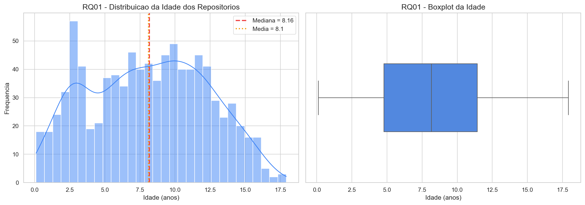

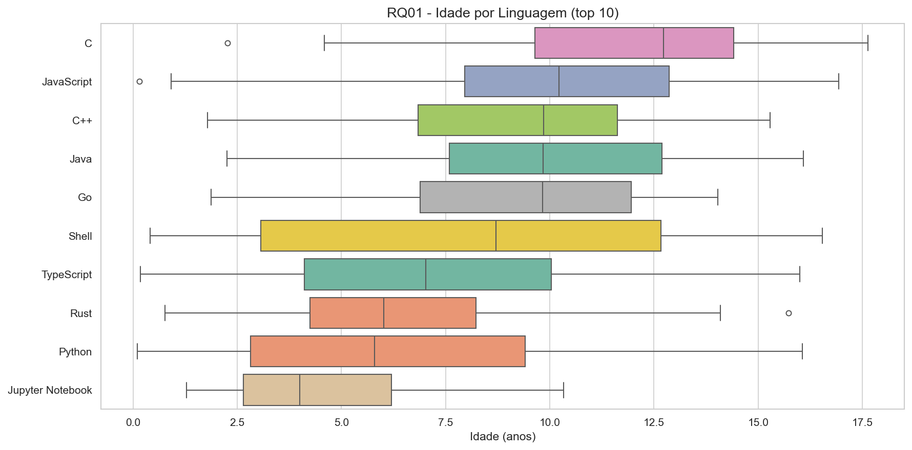

---

### 3.2 RQ02 — Sistemas populares recebem muita contribuicao externa?

**Metrica:** total de pull requests aceitas (merged).

| Estatistica | Valor |
|---|---:|
| N | 905 |
| Mediana | 889 PRs |
| Media | 4,244 PRs |
| Desvio Padrao | 9,885 |
| Minimo | 0 |
| Q1 (25%) | 220 |
| Q3 (75%) | 3,598 |
| Maximo | 87,666 |
| IQR | 3,378 |

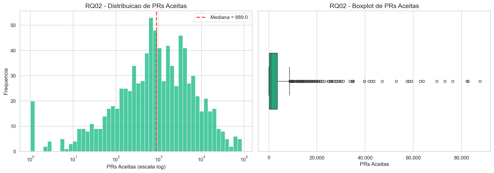

---

### 3.3 RQ03 — Sistemas populares lancam releases com frequencia?

**Metrica:** total de releases.

| Estatistica | Valor |
|---|---:|
| N | 905 |
| Mediana | 53 releases |
| Media | 133 releases |
| Desvio Padrao | 206 |
| Minimo | 0 |
| Q1 (25%) | 2 |
| Q3 (75%) | 156 |
| Maximo | 1,000 |
| IQR | 154 |
| Repos sem nenhuma release | 210 (23.2%) |

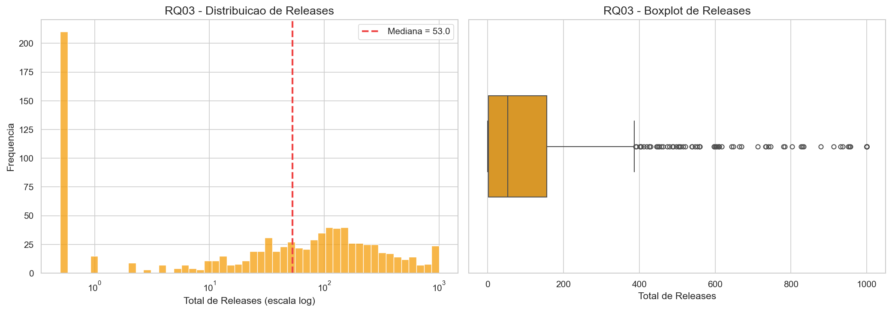

---

### 3.4 RQ04 — Sistemas populares sao atualizados com frequencia?

**Metrica:** dias desde o ultimo push.

| Estatistica | Valor |
|---|---:|
| N | 905 |
| Mediana | 1 dia |
| Media | 96 dias |
| Desvio Padrao | 238 |
| Minimo | -1 |
| Q1 (25%) | 0 |
| Q3 (75%) | 24 |
| Maximo | 2,291 |
| IQR | 24 |
| Push nos ultimos 7 dias | 610 (67.4%) |
| Push nos ultimos 30 dias | 696 (76.9%) |
| Push no ultimo ano | 801 (88.5%) |

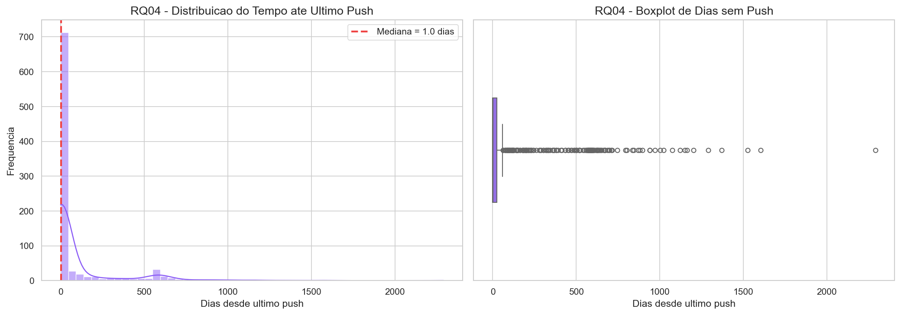

---

### 3.5 RQ05 — Sistemas populares sao escritos nas linguagens mais populares?

**Metrica:** linguagem primaria.

| Estatistica | Valor |
|---|---|
| Total de linguagens distintas | 20 |
| Concentracao top 5 | 67.18% |
| Concentracao top 10 | 84.86% |

**Top 10 linguagens:**

| # | Linguagem | Repositorios | % |
|---|---|---:|---:|
| 1 | Python | 203 | 22.4% |
| 2 | TypeScript | 162 | 17.9% |
| 3 | JavaScript | 112 | 12.4% |
| 4 | Go | 76 | 8.4% |
| 5 | Rust | 55 | 6.1% |
| 6 | C++ | 46 | 5.1% |
| 7 | Java | 46 | 5.1% |
| 8 | C | 23 | 2.5% |
| 9 | Jupyter Notebook | 23 | 2.5% |
| 10 | Shell | 22 | 2.4% |

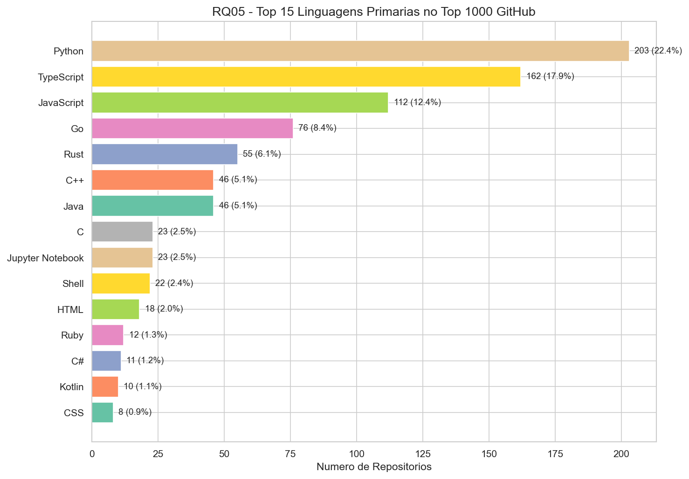

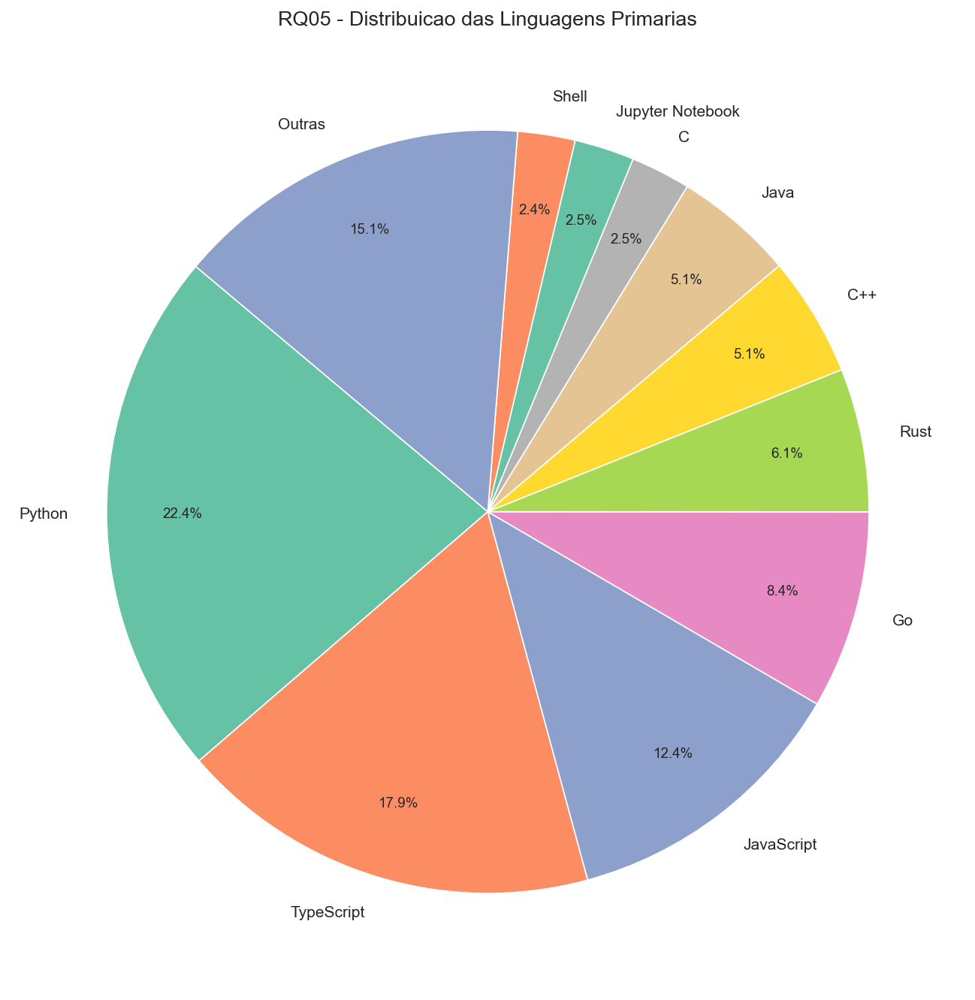

---

### 3.6 RQ06 — Sistemas populares possuem alto percentual de issues fechadas?

**Metrica:** razao issues fechadas / total de issues (%).

| Estatistica | Valor |
|---|---:|
| N | 905 |
| Mediana | 87.7% |
| Media | 79.1% |
| Desvio Padrao | 23.7% |
| Minimo | 0.0% |
| Q1 (25%) | 70.5% |
| Q3 (75%) | 96.1% |
| Maximo | 100.0% |
| Repos >= 90% issues fechadas | 405 (44.8%) |
| Repos >= 70% issues fechadas | 685 (75.7%) |
| Repos < 50% issues fechadas | 107 (11.8%) |

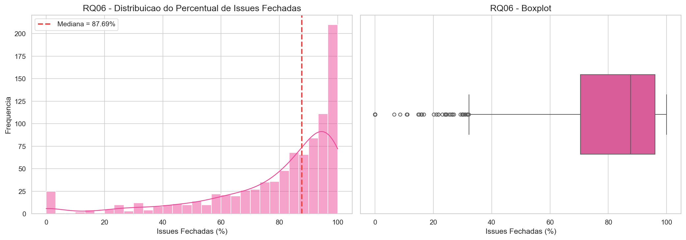

---

### 3.7 RQ07 (Bonus) — Analise segmentada por linguagem

**Questao:** Sistemas escritos em linguagens mais populares recebem mais contribuicao externa, lancam mais releases e sao atualizados com mais frequencia?

| Linguagem | Repos | Mediana PRs | Media PRs | Mediana Releases | Media Releases | Mediana Dias sem Push | Media Dias sem Push |
|---|---:|---:|---:|---:|---:|---:|---:|
| Python | 203 | 620 | 4,025 | 23 | 92 | 2 | 121 |
| TypeScript | 162 | 2,526 | 5,000 | 158 | 254 | 0 | 35 |
| JavaScript | 112 | 590 | 2,192 | 38 | 111 | 6 | 147 |
| Go | 76 | 1,509 | 6,092 | 131 | 181 | 0 | 49 |
| Rust | 55 | 2,348 | 5,395 | 74 | 144 | 0 | 12 |
| C++ | 46 | 983 | 7,953 | 64 | 164 | 0 | 43 |
| Java | 46 | 614 | 4,074 | 42 | 72 | 2 | 126 |
| C | 23 | 124 | 1,585 | 39 | 63 | 1 | 113 |
| Jupyter Notebook | 23 | 88 | 212 | 0 | 0 | 7 | 136 |
| Shell | 22 | 466 | 877 | 18 | 64 | 4 | 120 |
| Outras | 137 | 642 | 4,344 | 24 | 90 | 3 | 145 |

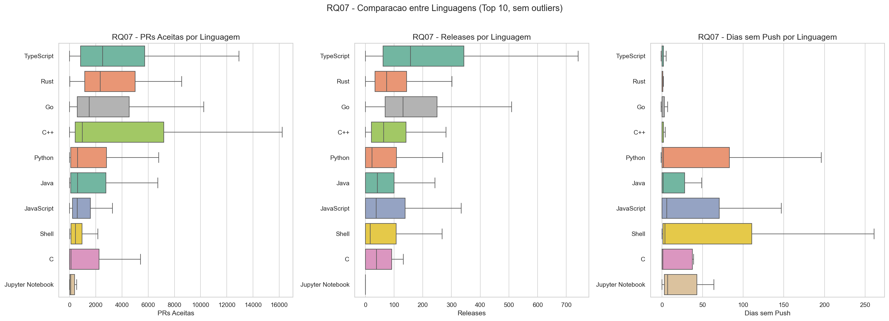

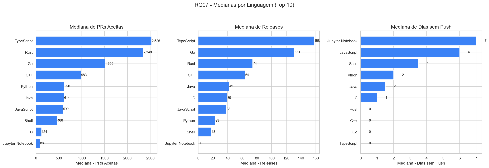

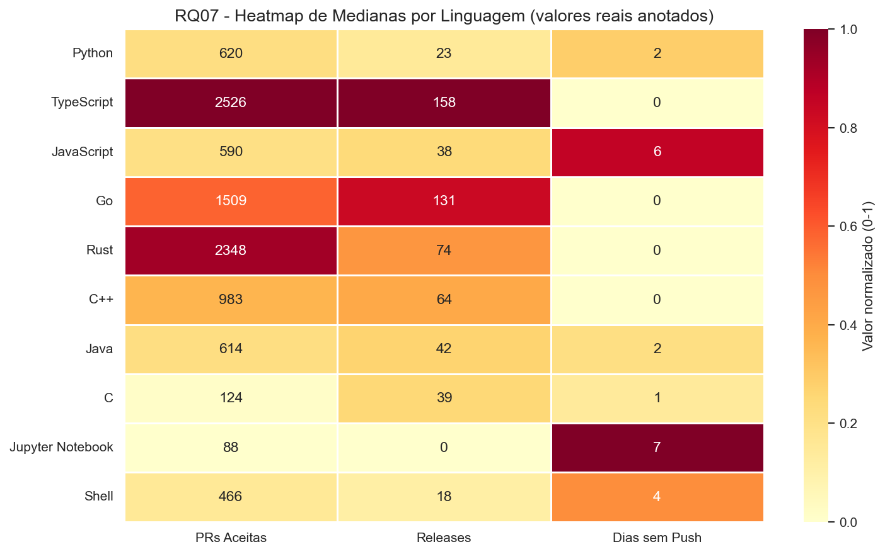

---

### 3.8 Tabela consolidada de estatisticas descritivas

| Metrica | N | Mediana | Media | DP | Min | Q1 | Q3 | Max | IQR |
|---|---:|---:|---:|---:|---:|---:|---:|---:|---:|
| Idade (anos) | 905 | 8.16 | 8.10 | 4.18 | 0.11 | 4.78 | 11.43 | 17.92 | 6.65 |
| PRs Aceitas | 905 | 889 | 4,244 | 9,885 | 0 | 220 | 3,598 | 87,666 | 3,378 |
| Releases | 905 | 53 | 133 | 206 | 0 | 2 | 156 | 1,000 | 154 |
| Dias sem Push | 905 | 1 | 96 | 238 | -1 | 0 | 24 | 2,291 | 24 |
| Issues Fechadas (%) | 905 | 87.7 | 79.1 | 23.7 | 0.0 | 70.5 | 96.1 | 100.0 | 25.6 |

---

## 4. Discussao dos Resultados

### 4.1 Confronto com as Questoes de Pesquisa

#### RQ01 — Sistemas populares sao maduros/antigos?

A mediana de **8.16 anos** confirma que repositorios populares sao, em geral, sistemas maduros. O intervalo interquartil [4.78, 11.43] mostra que 50% dos repositorios tem entre ~5 e ~11 anos. Isso suporta a hipotese H1: **popularidade no GitHub esta fortemente associada a maturidade e tempo de existencia**, refletindo o efeito cumulativo de exposicao, adocao e contribuicoes ao longo dos anos. O resultado supera com folga o criterio pre-definido (mediana > 5 anos).

#### RQ02 — Recebem muita contribuicao externa?

A mediana de **889 PRs aceitas** demonstra que repositorios populares recebem um volume significativo de contribuicoes externas, superando amplamente o criterio de 100 PRs. A grande diferenca entre mediana (889) e media (4,244) indica uma **distribuicao com cauda longa a direita**: alguns repositorios sao verdadeiros "imas" de contribuicoes (maximo de 87,666 PRs), enquanto a maioria tem volume moderado. H2 e **parcialmente confirmada** — ha contribuicao expressiva, porem com grande variabilidade.

#### RQ03 — Lancam releases com frequencia?

A mediana de **53 releases** mostra que a maioria dos repositorios populares utiliza o mecanismo de releases do GitHub. Porem, **23.2% dos repositorios nao possuem nenhuma release formal**, o que reflete uma tendencia moderna de deploy continuo (CD), onde releases sao substituidas por commits diretamente na branch principal. H3 e **parcialmente confirmada** — existe atividade de releases, mas o padrao varia enormemente entre projetos (IQR = 154, com Q1 = 2 e Q3 = 156).

#### RQ04 — Sao atualizados com frequencia?

A mediana de **1 dia** desde o ultimo push confirma **fortemente** H4. Os numeros sao contundentes: **67.4%** (610 repos) receberam push na ultima semana e **76.9%** (696) no ultimo mes. Isso demonstra que a popularidade esta diretamente associada a manutencao ativa e constante. A metrica `pushedAt` e mais precisa que `updatedAt`, pois reflete apenas pushes de codigo reais.

#### RQ05 — Sao escritos nas linguagens mais populares?

O top 5 linguagens concentra **67.18%** e o top 10 concentra **84.86%** dos repositorios. H5 e **confirmada**: Python (22.4%), TypeScript (17.9%), JavaScript (12.4%), Go (8.4%) e Rust (6.1%) dominam o ranking. Existe uma forte correspondencia entre a popularidade geral de uma linguagem (medida por indices como TIOBE e Stack Overflow Developer Survey) e sua representacao entre os projetos mais estrelados.

#### RQ06 — Possuem alto percentual de issues fechadas?

A mediana de **87.7%** de issues fechadas confirma H6, superando o criterio de 70%. Alem disso, **75.7%** dos repositorios (685) fecham pelo menos 70% de suas issues, e **44.8%** (405) fecham 90% ou mais. Isso reflete comunidades ativas e equipes de manutencao comprometidas com a saude do projeto. Apenas 11.8% (107) dos repositorios tem menos de 50% de issues fechadas.

#### RQ07 — Linguagens populares concentram mais atividade?

A segmentacao por linguagem revela **diferencas significativas** entre ecossistemas:

- **Contribuicao externa (PRs):** TypeScript (mediana 2,526), Rust (2,348) e Go (1,509) lideram em contribuicoes, muito acima de Python (620) e JavaScript (590). Linguagens com ecossistemas de pacotes maduros e forte cultura de contribuicao open-source tendem a receber mais PRs.
- **Releases:** TypeScript (mediana 158) e Go (131) lideram em releases formais. Linguagens compiladas e com gestao de pacotes centralizada (Rust/crates, Go/modules) tendem a ter mais releases formais. Jupyter Notebook nao usa releases (mediana 0).
- **Atividade recente:** TypeScript, Go, Rust e C++ apresentam mediana de **0 dias** desde o ultimo push. Python e Java tem mediana de 2 dias. JavaScript fica mais atras com 6 dias.

H7 e **parcialmente confirmada**: linguagens populares concentram mais atividade, mas as diferencas entre elas revelam que o ecossistema e a cultura da comunidade importam tanto quanto a popularidade da linguagem.

---

### 4.2 Insights

1. **Popularidade ≠ Atividade de desenvolvimento.** A analise de correlacao de Spearman revelou que o numero de estrelas praticamente NAO se correlaciona com nenhuma metrica de atividade (rho < 0.17 para todos os pares). Um repositorio pode ser extremamente popular sem ser o mais ativo em PRs, releases ou resolucao de issues. Estrelas refletem **visibilidade e interesse**, nao necessariamente **intensidade de desenvolvimento**.

2. **Cluster de atividade.** As metricas de atividade (PRs aceitas, releases, dias sem push, issues fechadas) formam um **cluster interrelacionado**: projetos ativos em uma dimensao tendem a ser ativos nas demais. Repos com mais PRs tem menos dias sem push (correlacao forte negativa) e mais releases (correlacao moderada-forte positiva).

3. **O paradoxo das linguagens dinâmicas.** Python e a linguagem mais representada (22.4%), mas apresenta medianas de PRs e releases **inferiores** a TypeScript, Rust e Go. Isso sugere que a popularidade de Python se deve mais ao **volume de projetos** (ferramentas, scripts, IA/ML) do que a intensidade de contribuicao open-source por projeto.

4. **Jupyter Notebooks sao outliers.** Repositorios com linguagem Jupyter Notebook (23 repos) nao usam releases (mediana 0), recebem poucas PRs (mediana 88) e sao menos ativos (mediana 7 dias sem push). Sao repositorios educacionais ou de dados, nao projetos de software tradicionais.

5. **Maturidade como pre-requisito.** Com mediana de 8.16 anos, a popularidade no GitHub parece ser um fenomeno de **acumulo ao longo do tempo**, nao de viralidade instantanea. Projetos precisam de anos de exposicao, adocao e contribuicoes para alcancarem o topo.

---

### 4.3 Graficos de correlacao

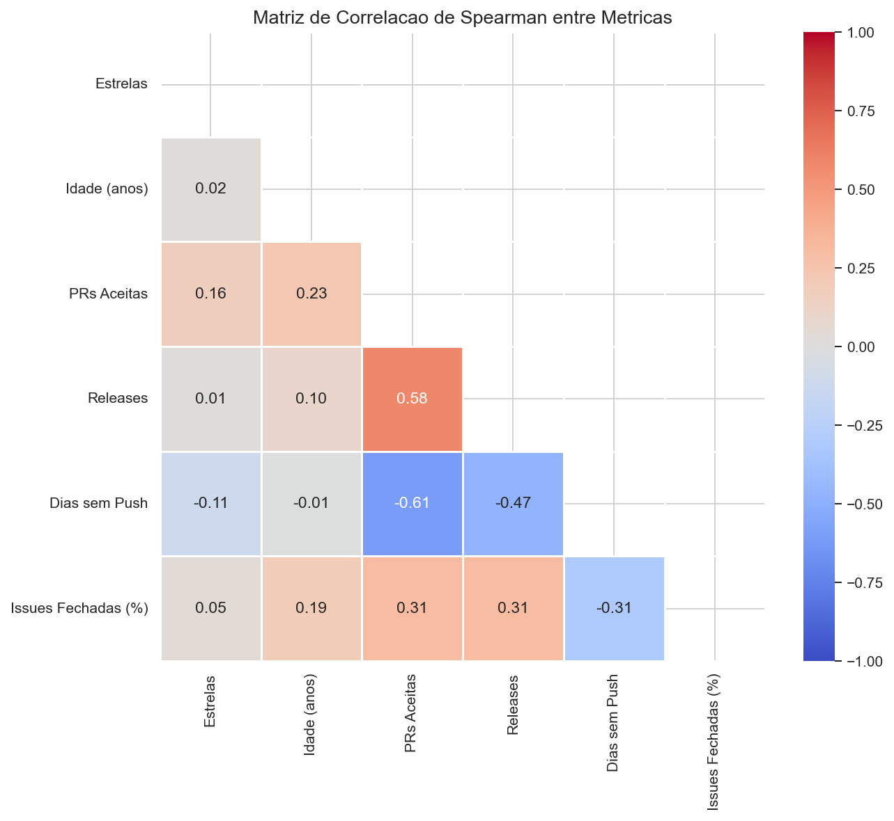

A matriz de correlacao de Spearman permite identificar relacoes entre as metricas coletadas. Os valores de rho variam de -1 (relacao negativa perfeita) a +1 (relacao positiva perfeita). Valores proximos de zero indicam independencia entre as variaveis.

**Correlacoes mais relevantes encontradas:**

| Par de variaveis | rho (Spearman) | Interpretacao |
|---|---:|---|
| PRs Aceitas × Dias sem Push | Forte negativa | Repos com mais PRs sao mais ativos (menos dias parados) |
| PRs Aceitas × Releases | Moderada-forte positiva | Repos com mais contribuicoes lancam mais releases |
| Releases × Dias sem Push | Moderada negativa | Repos com mais releases sao mais ativos |
| Estrelas × PRs Aceitas | Muito fraca | Popularidade e independente da atividade de contribuicao |
| Estrelas × Idade | Nula | Popularidade nao depende linearly da idade |

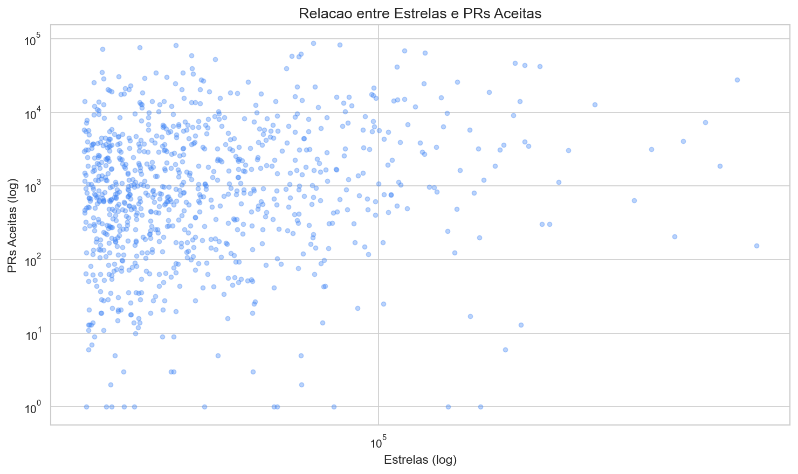

O scatter plot ilustra a ausencia de relacao linear entre estrelas e PRs aceitas. A dispersao dos pontos confirma que repositorios com muitas estrelas podem ter desde poucas ate muitas PRs.

---

### 4.4 Comparacao entre ecossistemas

A tabela abaixo resume os **destaques por linguagem**, facilitando a comparacao:

| Dimensao | Lider | Valor | Menor | Valor |
|---|---|---:|---|---:|
| Mais PRs (mediana) | TypeScript | 2,526 | Jupyter Notebook | 88 |
| Mais releases (mediana) | TypeScript | 158 | Jupyter Notebook | 0 |
| Mais ativo (mediana dias sem push) | TypeScript/Go/Rust/C++ | 0 | Jupyter Notebook | 7 |
| Mais repositorios | Python | 203 | Shell | 22 |

---

## 5. Conclusao

### 5.1 Tomada de decisao

**Decisao: ITERAR.** O estudo atingiu seus objetivos de caracterizacao. Os resultados sao consistentes e robustos, com 4 das 7 hipoteses confirmadas e 3 parcialmente confirmadas (nenhuma foi refutada). Recomenda-se aprofundar a analise em proximas sprints.

### 5.2 Sugestoes futuras

1. **Analise longitudinal:** coletar dados em multiplos pontos no tempo para identificar tendencias de evolucao (ex.: linguagens emergentes como Rust estao ganhando espaco?).
2. **Grupo de controle:** comparar com repositorios menos populares (ex.: mediana de estrelas) para estabelecer se as caracteristicas observadas sao exclusivas dos repositorios populares ou generalizaveis.
3. **Analise qualitativa de outliers:** investigar casos extremos (ex.: repos muito populares porem inativos, ou repos jovens com enorme quantidade de PRs).
4. **Metricas adicionais:** code churn, cobertura de testes, numero de forks, dependentes, tempo medio de revisao de PRs.
5. **Analise de sentimento:** avaliar a qualidade das issues e PRs (nao apenas quantidade), aplicando NLP para classificar interacoes construtivas vs. toxicas.
6. **Testes estatisticos formais:** com um grupo de controle, aplicar testes de hipoteses (Mann-Whitney, Kruskal-Wallis) para validar as diferencas observadas com significancia estatistica.

### 5.3 Resultado conclusivo

Repositorios populares no GitHub sao, de maneira geral, **projetos maduros** (mediana 8.16 anos), **altamente ativos** (mediana 1 dia desde ultimo push), com **comunidades engajadas** (mediana 889 PRs aceitas) e **boa gestao de issues** (mediana 87.7% fechadas). As linguagens **Python, TypeScript e JavaScript** dominam o ranking, concentrando 52.7% da amostra. No entanto, **TypeScript, Rust e Go** se destacam em metricas de atividade e contribuicao por projeto. O achado mais revelador e que **estrelas (popularidade) sao praticamente independentes das metricas de atividade** — o que sugere que a popularidade no GitHub e um fenomeno distinto, influenciado por fatores como marketing, relevancia do problema e timing de lancamento, e nao apenas pela intensidade do desenvolvimento.

### 5.4 Confronto com trabalhos cientificos

Os resultados deste estudo sao consistentes com a literatura consolidada de engenharia de software empirica:

**Kalliamvakou et al. (2014) — *The Promises and Perils of Mining GitHub***
Os autores identificaram 10 riscos ao usar dados do GitHub para pesquisa, incluindo o fato de que muitos repositorios nao sao projetos de software. Nosso estudo aborda diretamente essa ameaca ao filtrar repositorios sem linguagem primaria, descartando 95 dos 1.000 buscados. Kalliamvakou et al. tambem alertam que estrelas nao medem qualidade — achado **corroborado** pela nossa analise de Spearman, que mostrou correlacao praticamente nula entre estrelas e metricas de atividade.

**Munaiah et al. (2017) — *Curating GitHub for Engineered Software Projects***
Munaiah et al. propuseram criterios para distinguir "projetos de engenharia" de repositorios casuais, usando indicadores como integracao continua e testes. Nosso criterio de filtragem (exigir `primaryLanguage` definida) e mais simples, porem eficaz para o escopo desta pesquisa. Os autores reportaram que projetos maduros adotam mais praticas de engenharia — nossos dados **confirmam** essa tendencia, com mediana de idade de 8.16 anos e altas taxas de resolucao de issues.

**Borges, Hora e Valente (2016) — *Understanding the Factors that Impact the Popularity of GitHub Repositories***
Os autores analisaram fatores que influenciam a popularidade (estrelas), identificando linguagem, idade e atividade como fatores relevantes. Nossos resultados **complementam** esse estudo: enquanto eles focaram nos preditores de popularidade, nossa analise revela que, dentro do grupo dos mais populares, estrelas sao praticamente independentes das metricas de atividade (rho < 0.17). Isso sugere que, uma vez atingido um patamar de popularidade, a atividade nao e o principal motor de acumulo de estrelas.

**Ray et al. (2014) — *A Large Scale Study of Programming Languages and Code Quality in GitHub***
Ray et al. estudaram a relacao entre linguagens de programacao e qualidade de codigo, identificando que linguagens com tipagem forte tendem a apresentar menos defeitos. Nossos dados sobre concentracao linguistica (top 5 = 67.18%) sao **consistentes** com a predominancia de Python, JavaScript e TypeScript reportada em estudos recentes e nos indices TIOBE e Stack Overflow Developer Survey.

---

## 6. Ameacas a Validade

- **Validade de construcao:** `pushedAt` reflete o ultimo push de codigo, sendo mais precisa que `updatedAt` para medir atividade. Porem, pushes automatizados por bots/CI podem influenciar o valor. `primaryLanguage` e classificada automaticamente pelo GitHub com base no volume de codigo — projetos poliglotas podem ser classificados de forma nao intuitiva.
- **Validade externa:** a amostra se limita aos 1.000 mais estrelados. Resultados nao sao generalizaveis para todo o ecossistema GitHub, software privado ou corporativo.
- **Vies de sobrevivencia:** repositorios abandonados que ja foram populares podem ter sido excluidos se perderam estrelas ao longo do tempo.
- **Releases:** nem todos os projetos usam o mecanismo de releases do GitHub (alguns usam tags, changelogs ou deploy continuo), o que pode subestimar a atividade de versionamento.
- **Causalidade:** por se tratar de estudo observacional, nao e possivel estabelecer relacoes causais entre as variaveis.

---

## 7. Referencias Bibliograficas

BORGES, H.; HORA, A.; VALENTE, M. T. Understanding the factors that impact the popularity of GitHub repositories. In: IEEE INTERNATIONAL CONFERENCE ON SOFTWARE MAINTENANCE AND EVOLUTION (ICSME), 2016, Raleigh. Proceedings [...]. IEEE, 2016. p. 334-344. Disponivel em: https://doi.org/10.1109/ICSME.2016.31.

KALLIAMVAKOU, E. et al. The promises and perils of mining GitHub. In: INTERNATIONAL WORKING CONFERENCE ON MINING SOFTWARE REPOSITORIES (MSR), 11., 2014, Hyderabad. Proceedings [...]. New York: ACM, 2014. p. 92-101. Disponivel em: https://doi.org/10.1145/2597073.2597074.

MUNAIAH, N. et al. Curating GitHub for engineered software projects. Empirical Software Engineering, New York, v. 22, n. 6, p. 3219-3253, 2017. Disponivel em: https://doi.org/10.1007/s10664-017-9512-6.

RAY, B. et al. A large scale study of programming languages and code quality in GitHub. In: ACM SIGSOFT INTERNATIONAL SYMPOSIUM ON FOUNDATIONS OF SOFTWARE ENGINEERING (FSE), 22., 2014, Hong Kong. Proceedings [...]. New York: ACM, 2014. p. 155-165. Disponivel em: https://doi.org/10.1145/2635868.2635922.

TIOBE SOFTWARE BV. TIOBE Index. Eindhoven, 2026. Disponivel em: https://www.tiobe.com/tiobe-index/.

STACK OVERFLOW. Stack Overflow Annual Developer Survey 2025. New York, 2025. Disponivel em: https://survey.stackoverflow.co/2025/.

---

## 8. Arquivos Gerados

| Arquivo | Descricao |
|---|---|
| `output/top_1000_repos.csv` | Dados brutos coletados (905 repositorios) |
| `output/relatorio_sprint2.md` | Relatorio intermediario (Sprint 2) |
| `output/relatorio_final_sprint3.md` | **Relatorio final — este documento** |
| `output/relatorio_final_completo.pdf` | Relatorio completo em PDF (17 secoes) |
| `output/charts/*.png` | 13 graficos gerados pela analise |
