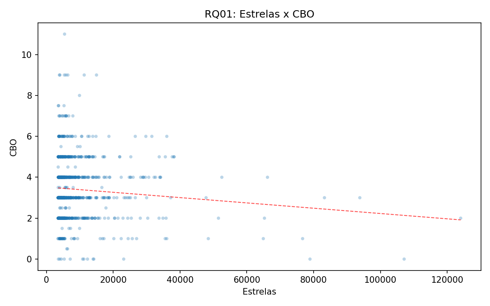
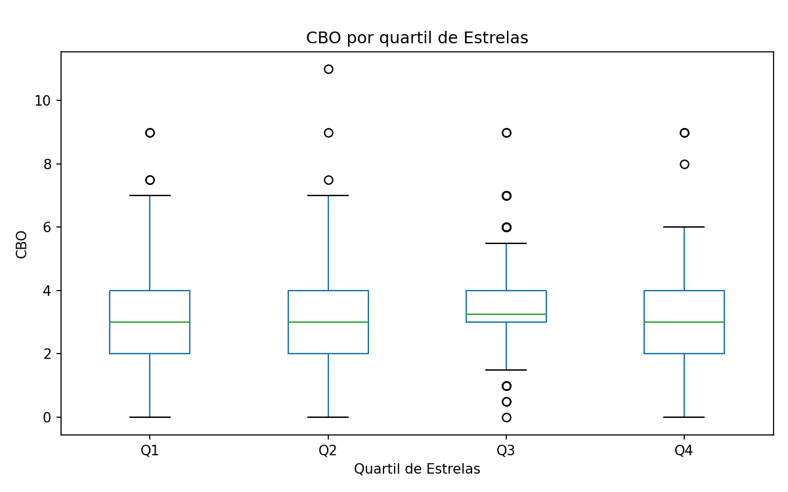
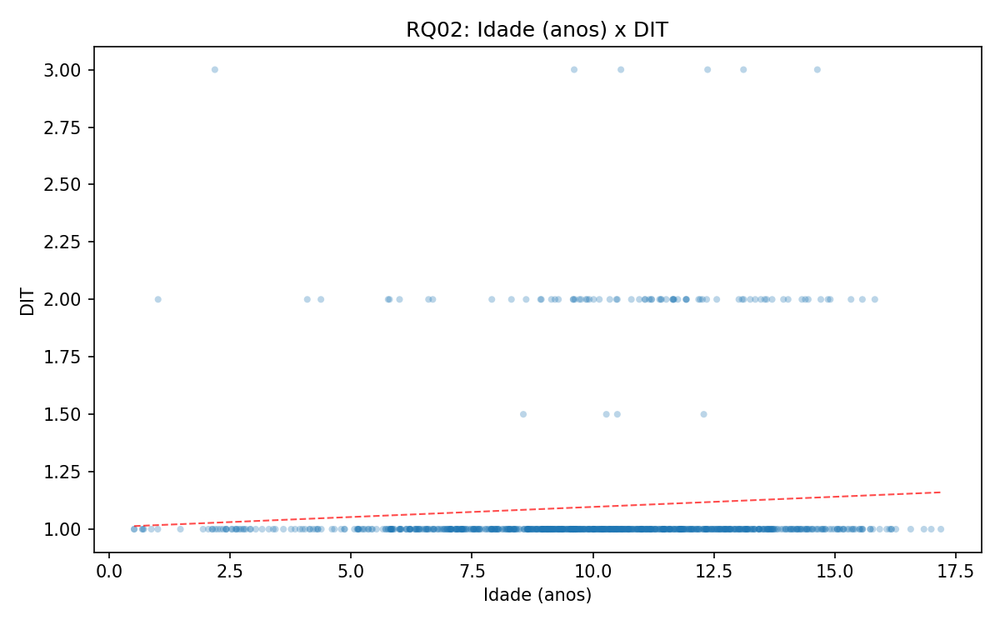
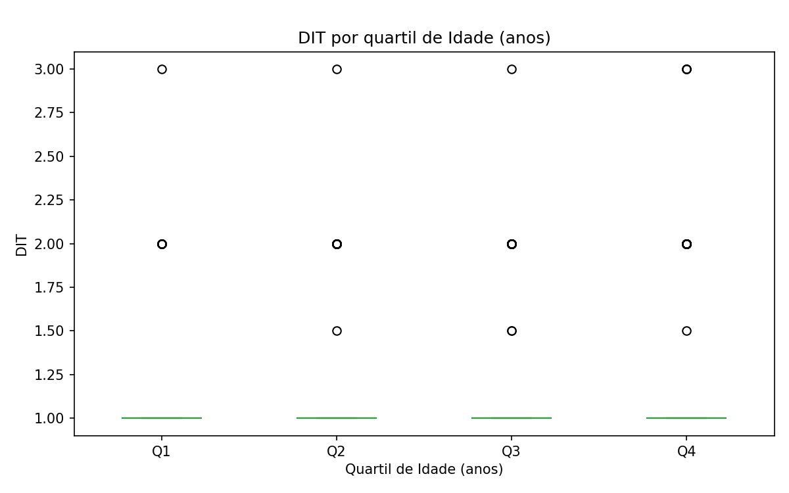
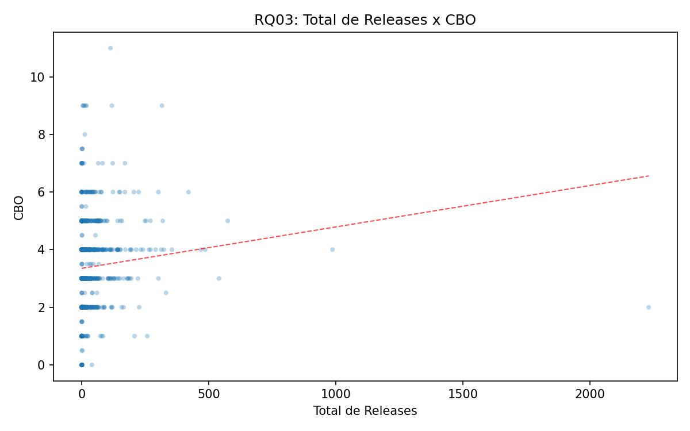
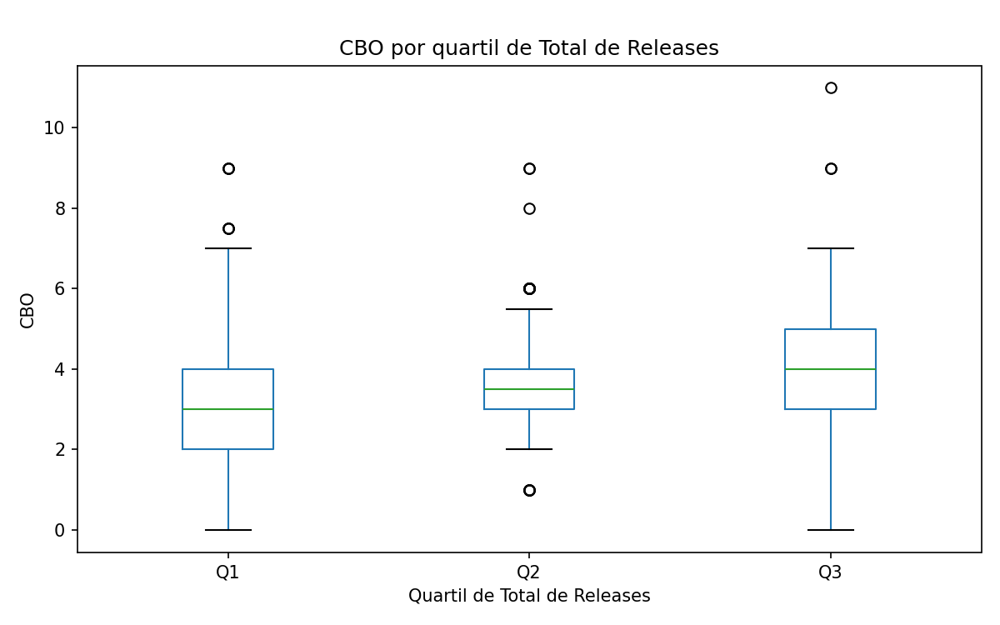
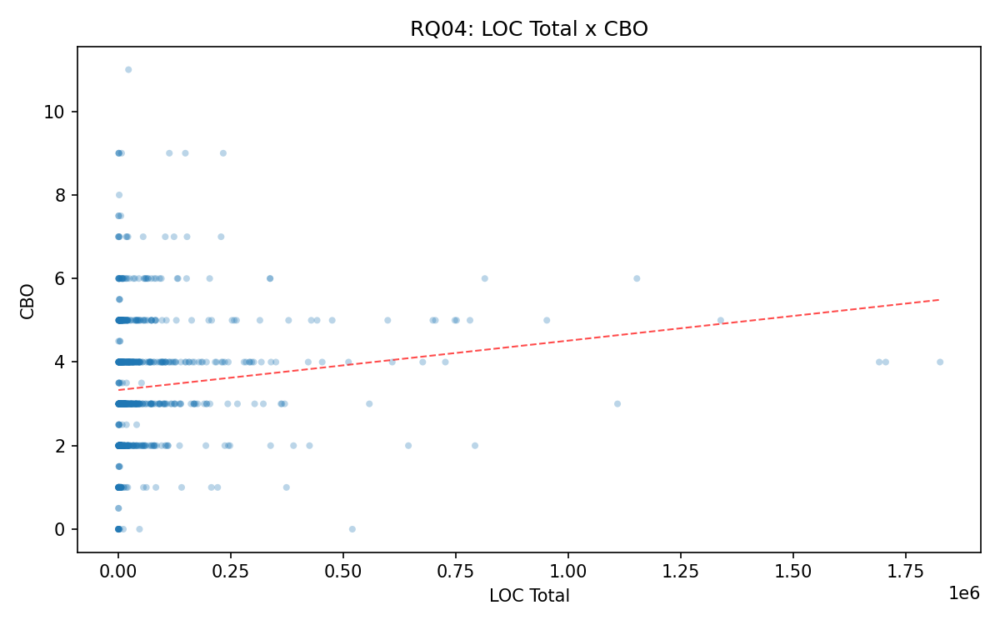
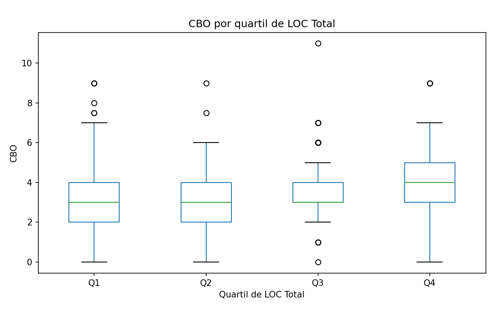

# Roteiro de Apresentação (profissional e objetivo)

Duração sugerida: 10 a 12 minutos

---

## 1) Abertura (30-45s)

**Texto sugerido para fala:**

“Neste trabalho, investigamos se características de processo de desenvolvimento em repositórios Java estão associadas à qualidade interna do código.  
Para isso, relacionamos popularidade, maturidade, atividade e tamanho com três métricas de qualidade: CBO, DIT e LCOM.”

---

## 2) Visão geral do experimento (1 min)

**Texto sugerido para fala:**

“Coletamos os 1000 repositórios Java mais populares do GitHub.  
Conseguimos processar 897, e a análise estatística final foi feita com 896 repositórios válidos.”

**Métricas de processo:**
- Estrelas (popularidade)
- Idade em anos (maturidade)
- Total de releases (atividade)
- LOC total (tamanho)

**Métricas de qualidade (CK):**
- **CBO (Coupling Between Objects)**: mede quantas dependências uma classe tem com outras classes.
- **DIT (Depth of Inheritance Tree)**: mede quão profunda é a herança de uma classe.
- **LCOM (Lack of Cohesion of Methods)**: mede falta de coesão, ou seja, quanto os métodos de uma classe são pouco relacionados entre si.

### 2.1 O que as métricas CK significam neste contexto (explicação completa)

**Como o CK foi usado no trabalho:**
- O CK calcula métricas por classe (`class.csv`).
- Depois, no nosso experimento, os valores foram **agregados por repositório** (média/mediana/desvio padrão).
- Ou seja, quando falamos “CBO de um repositório”, estamos falando de um resumo das classes daquele repositório.

**CBO no contexto deste trabalho:**
- CBO alto significa que as classes dependem de muitas outras classes.
- Em termos práticos, isso aumenta o custo de manutenção: mudar uma classe pode impactar várias outras.
- **Por que importa para as RQs?** Se CBO aumenta com atividade/tamanho, isso sugere que crescimento do projeto vem com aumento de complexidade estrutural.

**DIT no contexto deste trabalho:**
- DIT indica profundidade de herança.
- DIT maior pode representar maior reutilização, mas também mais dificuldade para entender o comportamento da classe (porque o comportamento fica distribuído em várias camadas).
- **Por que importa para as RQs?** Se maturidade aumentasse muito o DIT, poderíamos inferir que projetos antigos acumulam hierarquias de herança mais profundas.

**LCOM no contexto deste trabalho:**
- LCOM alto indica classes menos coesas (métodos pouco relacionados).
- Em geral, baixa coesão sinaliza design pior e menor manutenibilidade.
- **Por que importa para as RQs?** Se LCOM aumenta com tamanho/atividade, isso sugere risco de degradação arquitetural com o crescimento do projeto.

**Como interpretar “melhor” e “pior” nessas métricas:**
- Para este estudo, de forma prática:
  - **CBO menor** tende a ser melhor (menos acoplamento).
  - **LCOM menor** tende a ser melhor (mais coesão).
  - **DIT** não é simplesmente “quanto menor melhor”; valores muito altos podem dificultar manutenção, mas valores muito baixos também podem indicar pouco uso de abstração.

**Como interpretar as correlações com essas métricas:**
- Exemplo: `releases x CBO` com rho positivo significa que, em geral, repositórios mais ativos tendem a ter maior acoplamento.
- Exemplo: `estrelas x CBO` perto de zero significa que popularidade não ajuda a prever acoplamento.
- Resultado significativo (`p < 0.05`) indica confiança estatística na associação; o tamanho do efeito vem do `rho`.

---

## 3) Como interpretar os gráficos (45s)

**Texto sugerido para fala:**

“No scatter plot, cada ponto é um repositório e a linha tracejada mostra tendência geral.  
No boxplot, comparamos quartis; se a mediana cresce de Q1 para Q4, há tendência.  
No heatmap, cada célula mostra o rho de Spearman.”

**Regra prática para interpretação:**
- `|rho| < 0.10`: efeito desprezível (praticamente irrelevante)
- `0.10 ≤ |rho| < 0.30`: efeito fraco (relevante, mas pequeno)
- `p < 0.05`: associação estatisticamente significativa

---

## 4) Resultados por questão de pesquisa

## RQ01 — Popularidade (estrelas) x qualidade

**Leitura prática nesta RQ:**
- Se estrelas aumentassem junto com **CBO menor** e **LCOM menor**, poderíamos dizer que popularidade está associada a melhor qualidade interna.

**Números principais:**
- estrelas x CBO: `rho = 0.0218`, `p = 0.51483`
- estrelas x DIT: `rho = -0.0423`, `p = 0.206343`
- estrelas x LCOM: `rho = 0.0241`, `p = 0.470763`

**Por que isso é relevante/irrelevante?**
- Todos os valores de rho estão muito próximos de zero.
- Todos os p-valores estão acima de 0.05.
- Portanto, a associação é estatisticamente não significativa e de magnitude desprezível.

**Resposta da RQ01:**  
A popularidade não explicou qualidade interna. Ter mais estrelas não significou melhor (nem pior) CBO, DIT ou LCOM.

---

## RQ02 — Maturidade (idade) x qualidade

**Leitura prática nesta RQ:**
- Se idade aumentasse com **CBO menor** e **LCOM menor**, isso sugeriria melhoria com o tempo; se aumentasse com CBO/LCOM, sugeriria acúmulo de complexidade.

**Números principais:**
- idade x CBO: `rho = 0.0009`, `p = 0.979522`
- idade x DIT: `rho = 0.1054`, `p = 0.001576`
- idade x LCOM: `rho = 0.0797`, `p = 0.016958`

**Por que isso é relevante/irrelevante?**
- CBO: efeito nulo (irrelevante).
- DIT: significativo e fraco (há associação, mas pequena).
- LCOM: significativo, porém com magnitude muito baixa.

**Resposta da RQ02:**  
A maturidade teve efeito pequeno. O principal sinal foi um leve aumento de DIT em repositórios mais antigos.

---

## RQ03 — Atividade (releases) x qualidade

**Leitura prática nesta RQ:**
- Se releases aumentam junto com **CBO maior** e **LCOM maior**, isso pode indicar que a evolução contínua traz custo estrutural de manutenção.

**Números principais:**
- releases x CBO: `rho = 0.2611`, `p = 0.0`
- releases x DIT: `rho = -0.0437`, `p = 0.191554`
- releases x LCOM: `rho = 0.1248`, `p = 0.000181`

**Por que isso é relevante/irrelevante?**
- `releases x CBO` foi o maior rho do estudo: é o sinal mais importante para esta RQ.
- `releases x LCOM` também é relevante, mas menor.
- DIT segue sem efeito prático.
- Nos gráficos, a tendência de CBO cresce com atividade.

**Resposta da RQ03:**  
Sim, atividade se relaciona com qualidade: mais releases tendem a vir com maior acoplamento (CBO) e leve piora de coesão (LCOM).

---

## RQ04 — Tamanho (LOC) x qualidade

**Leitura prática nesta RQ:**
- Nesta análise, crescimento em LOC era esperado como possível fator de aumento de acoplamento e de perda de coesão.

**Números principais:**
- LOC x CBO: `rho = 0.2314`, `p = 0.0`
- LOC x DIT: `rho = -0.0268`, `p = 0.422339`
- LOC x LCOM: `rho = 0.1362`, `p = 0.000043`

**Por que isso é relevante/irrelevante?**
- `LOC x CBO` foi o segundo maior sinal do estudo: relevante para responder a RQ04.
- `LOC x LCOM` é significativo, porém fraco.
- DIT não apresentou relação útil.
- No boxplot, o quartil de maior tamanho (Q4) tem mediana de CBO mais alta.

**Resposta da RQ04:**  
Sim, tamanho se relaciona com qualidade: repositórios maiores tendem a ter maior acoplamento e leve aumento de falta de coesão.

---

## 5) Síntese visual final (Heatmap) (45s)

**Texto sugerido para fala:**

“O heatmap resume as 12 correlações.  
As associações mais fortes foram `releases x CBO (0.26)` e `LOC x CBO (0.23)`.  
Popularidade por estrelas ficou próxima de zero em todas as métricas, e DIT também ficou baixo na maior parte dos casos.”

**Mensagem-chave para convencer:**

“Neste estudo, o que mais se associou à qualidade interna foi atividade e tamanho; popularidade não foi um bom preditor.”

---

## 6) Conclusão para encerrar a apresentação (45s)

**Resumo final:**
- **RQ01:** popularidade não explicou qualidade.
- **RQ02:** maturidade teve efeito pequeno.
- **RQ03:** atividade mostrou associação mais clara, principalmente com CBO.
- **RQ04:** tamanho também mostrou associação, principalmente com CBO.

**Fecho recomendado:**

“Apesar de haver associações estatísticas em parte dos resultados, os efeitos foram fracos. Isso indica que qualidade de código é multifatorial e não pode ser explicada por uma única variável de processo.”

---

## 7) Perguntas do professor (respostas prontas)

**Pergunta:** “Se é significativo, por que você diz que é fraco?”  
**Resposta:** “Porque o p-valor indica existência de associação, enquanto o rho mede a magnitude. Aqui a associação existe, mas com efeito pequeno.”

**Pergunta:** “Qual foi o achado mais importante?”  
**Resposta:** “As maiores correlações foram atividade e tamanho com CBO; popularidade por estrelas não previu qualidade interna.”

**Pergunta:** “Por que usar Spearman?”  
**Resposta:** “Porque os dados são assimétricos e têm outliers. Spearman é mais robusto nesse cenário e adequado para relações monotônicas.”
