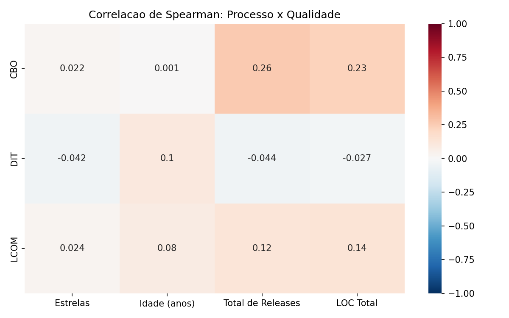
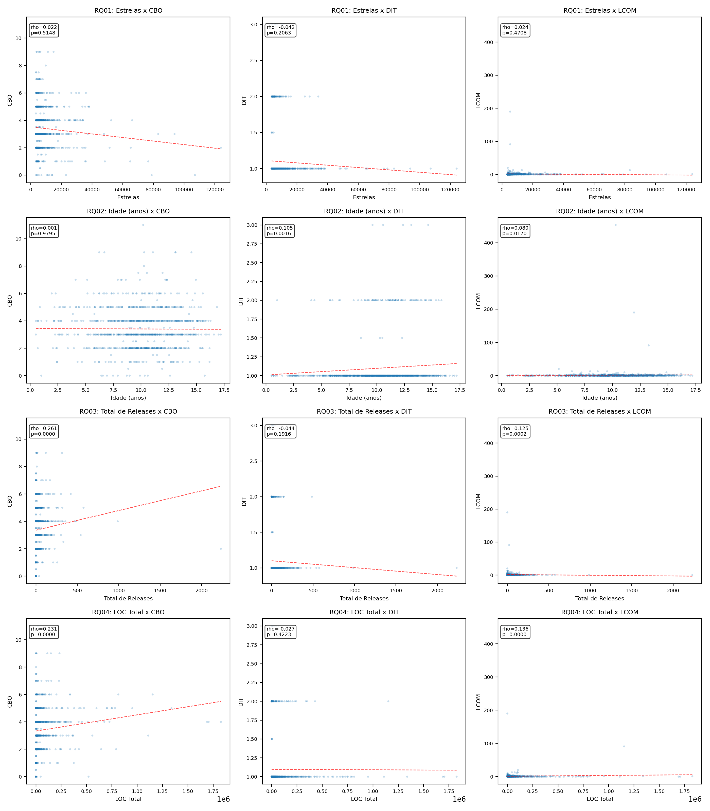
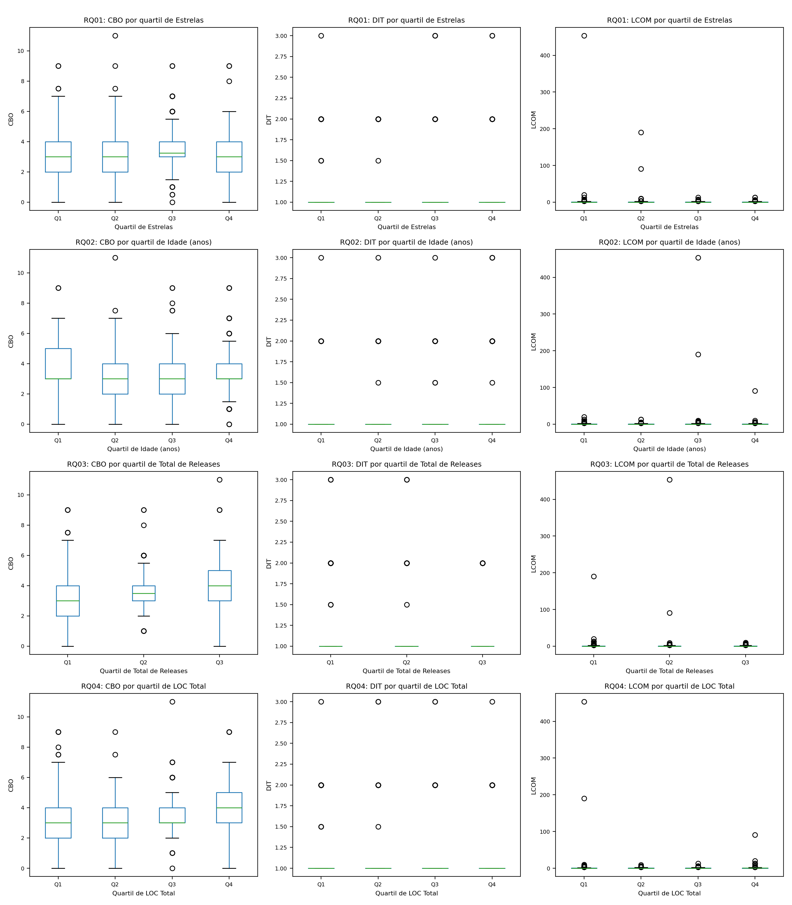

# Relatório Final — Laboratório 2: Um Estudo das Características de Qualidade de Sistemas Java

> Autor(es): Isaac Portela, M. Xavier  
> Disciplina: Laboratório de Experimentação de Software  
> Data: Março/2026

---

## 1. Introdução

### 1.1 Contextualização

No processo de desenvolvimento de sistemas open-source, em que diversos desenvolvedores contribuem em partes diferentes do código, um dos riscos a serem gerenciados diz respeito à evolução dos seus atributos de qualidade interna. Isto é, ao se adotar uma abordagem colaborativa, corre-se o risco de tornar vulnerável aspectos como modularidade, manutenibilidade ou legibilidade do software produzido. Para tanto, diversas abordagens modernas buscam aperfeiçoar tal processo, através da adoção de práticas relacionadas à revisão de código ou à análise estática através de ferramentas de CI/CD.

Neste contexto, o objetivo deste laboratório é analisar aspectos da qualidade de repositórios desenvolvidos na linguagem Java, correlacionando-os com características do seu processo de desenvolvimento, sob a perspectiva de métricas de produto calculadas através da ferramenta CK.

### 1.2 Problema foco do experimento

Verificar se características observáveis do processo de desenvolvimento — popularidade, maturidade, atividade e tamanho — estão associadas à qualidade interna do código-fonte de repositórios Java populares, medida por CBO, DIT e LCOM.

### 1.3 Questões de Pesquisa

- **RQ01:** Qual a relação entre a popularidade dos repositórios e as suas características de qualidade?
- **RQ02:** Qual a relação entre a maturidade dos repositórios e as suas características de qualidade?
- **RQ03:** Qual a relação entre a atividade dos repositórios e as suas características de qualidade?
- **RQ04:** Qual a relação entre o tamanho dos repositórios e as suas características de qualidade?

### 1.4 Hipóteses informais

Antes da análise dos dados, foram formuladas as seguintes hipóteses:

- **H1 (Popularidade):** Espera-se que repositórios mais populares (mais estrelas) apresentem melhor qualidade interna, uma vez que código legível e bem estruturado tende a atrair mais colaboradores e, consequentemente, mais estrelas.

- **H2 (Maturidade):** Espera-se que repositórios mais maduros (mais antigos) apresentem maior complexidade estrutural, pois ao longo dos anos o código acumula funcionalidades e dependências entre classes, podendo elevar CBO e DIT.

- **H3 (Atividade):** Espera-se que repositórios com maior atividade (mais releases) apresentem maior acoplamento e menor coesão, pois a adição frequente de funcionalidades pode introduzir dependências entre classes sem o devido cuidado com refatoração.

- **H4 (Tamanho):** Espera-se que repositórios maiores (mais LOC) apresentem maior acoplamento (CBO) e menor coesão (LCOM), pois sistemas maiores são naturalmente mais difíceis de manter modularizados.

### 1.5 Objetivos

**Objetivo principal:** Analisar a relação entre métricas de processo de desenvolvimento e métricas de qualidade interna em repositórios Java populares do GitHub.

**Objetivos específicos:**

1. Coletar os 1.000 repositórios Java mais populares do GitHub.
2. Executar a ferramenta CK para extrair métricas de qualidade (CBO, DIT, LCOM) e sumarizar os resultados por repositório (média, mediana e desvio padrão).
3. Calcular correlações estatísticas (Spearman) entre métricas de processo e qualidade.
4. Gerar visualizações (scatter plots, boxplots e heatmap) para apoiar a interpretação dos resultados.
5. Confrontar os resultados obtidos com as hipóteses formuladas.

---

## 2. Metodologia

### 2.1 Passo a passo do experimento

1. **Coleta dos repositórios:** Utilizando a API REST do GitHub, foram coletados os 1.000 repositórios Java mais populares, ordenados por número de estrelas.
2. **Enriquecimento de metadados:** Para cada repositório, foram coletados via API o tamanho em KB e o total de releases.
3. **Clone e execução do CK:** Cada repositório foi clonado (shallow clone, `--depth 1`) e submetido à ferramenta CK (versão 0.7.0), que gera o arquivo `class.csv` com métricas por classe Java.
4. **Sumarização por repositório:** As métricas CBO, DIT, LCOM e LOC foram agregadas por repositório, calculando-se média, mediana e desvio padrão.
5. **Análise estatística:** Foram calculadas correlações de Spearman (rho e p-valor) entre cada métrica de processo e cada métrica de qualidade.
6. **Geração de gráficos:** Foram produzidos scatter plots com linha de tendência, boxplots por quartil e heatmap geral de correlação.

### 2.2 Decisões de projeto

- **Clone raso (`--depth 1`):** Reduz tempo de download e uso de disco.
- **Processamento paralelo (4 workers):** Viabiliza a coleta em escala, com isolamento entre workers.
- **Spearman em vez de Pearson:** Spearman é mais robusto para distribuições assimétricas e outliers, que são comuns neste tipo de dado.
- **Mediana como medida de tendência central:** Reduz a influência de classes extremas (outliers) na representação do repositório.

### 2.3 Materiais utilizados

- **Linguagem de programação:** Python 3.12+
- **Ferramenta de análise estática:** CK 0.7.0 (Java)
- **Bibliotecas:** Pandas, SciPy, Matplotlib, Seaborn, Requests
- **Fonte de dados:** API REST do GitHub
- **Controle de versão:** Git

### 2.4 Métodos utilizados

- Coleta automatizada via scripts Python.
- Análise estática com CK (`class.csv` por classe).
- Agregação estatística por repositório.
- Correlação de Spearman (rho e p-valor).
- Visualização: scatter plot, boxplot por quartis, heatmap.

### 2.5 Métricas e suas unidades

| Categoria | Métrica | Definição | Unidade | Origem |
|---|---|---|---|---|
| Processo | Estrelas | Número de estrelas no GitHub | contagem | GitHub API |
| Processo | Idade | Diferença entre a data atual e a data de criação | anos | GitHub API |
| Processo | Total de releases | Número de versões publicadas | contagem | GitHub API |
| Processo | LOC total | Soma de linhas de código de todas as classes | linhas | CK (`class.csv`) |
| Qualidade | CBO (Coupling Between Objects) | Número de classes das quais uma classe depende | índice | CK |
| Qualidade | DIT (Depth of Inheritance Tree) | Profundidade máxima da árvore de herança | índice | CK |
| Qualidade | LCOM (Lack of Cohesion of Methods) | Grau de falta de coesão entre métodos de uma classe | índice | CK |

**Interpretação prática das métricas de qualidade:**

- **CBO:** Valores altos indicam alto acoplamento — classes muito dependentes de outras. Dificulta manutenção: alterar uma classe pode causar efeito cascata em várias outras. *Ideal: valores baixos.*
- **DIT:** Valores altos indicam hierarquias de herança profundas — o comportamento da classe fica distribuído em muitas camadas. Dificulta compreensão e depuração. *Ideal: valores moderados.*
- **LCOM:** Valores altos indicam classes com métodos pouco relacionados entre si — sinal de design pobre, onde a classe acumula responsabilidades que deveriam estar separadas. *Ideal: valores baixos (próximos de 0).*

---

## 3. Visualização dos Resultados

### 3.1 Dados produzidos

Os seguintes arquivos foram gerados durante o experimento:

- `top_1000_java_repos.csv` — Lista dos 1.000 repositórios coletados.
- `top_1000_java_repos_enriquecido.csv` — Lista enriquecida com tamanho (KB) e total de releases.
- `ck_resultado_todos.csv` — Métricas CK sumarizadas para 897 repositórios processados.
- `descritivas_globais.csv` — Estatísticas descritivas das métricas.
- `correlacoes_spearman.csv` — Correlações de Spearman com rho, p-valor e interpretação.
- `charts/*.png` — 25 gráficos (scatter plots, boxplots e heatmap).

**Amostra final válida para análise estatística: 896 repositórios.**

### 3.2 Estatísticas descritivas (medidas centrais)

| Métrica | Média | Mediana | Desvio padrão | Mín | Máx | n |
|---|---:|---:|---:|---:|---:|---:|
| Estrelas | 9.099,63 | 5.665,0 | 10.477,82 | 3.474 | 124.039 | 896 |
| Idade (anos) | 10,02 | 10,21 | 3,11 | 0,51 | 17,20 | 896 |
| Total de releases | 37,77 | 10,0 | 102,89 | 0 | 2.232 | 896 |
| LOC total | 64.316,37 | 12.911,5 | 164.528,09 | 2 | 1.826.041 | 896 |
| CBO (mediana) | 3,41 | 3,0 | 1,48 | 0,0 | 11,0 | 896 |
| DIT (mediana) | 1,10 | 1,0 | 0,32 | 1,0 | 3,0 | 896 |
| LCOM (mediana) | 1,48 | 0,0 | 16,73 | 0,0 | 453,5 | 896 |

**Observações sobre a distribuição:**

- **Estrelas:** Distribuição fortemente assimétrica à direita (média muito acima da mediana), indicando poucos repositórios com muitas estrelas e a maioria com valores mais modestos.
- **LOC total:** Grande variabilidade (desvio padrão de 164 mil), com repositórios variando de 2 a 1,8 milhão de linhas.
- **Total de releases:** Mediana de 10, mas média de 37,77. Muitos repositórios possuem 0 releases; poucos possuem milhares.
- **DIT:** Extremamente concentrado em 1,0 (mediana = 1, máximo = 3). A maioria dos repositórios Java populares usa herança rasa.
- **LCOM:** Mediana igual a 0, mas média de 1,48 e máximo de 453,5. A maioria dos repositórios tem boa coesão, mas poucos são extremamente ruins.

### 3.3 Correlações de Spearman por questão de pesquisa

| RQ | Métrica de processo | Métrica de qualidade | rho | p-valor | Significativo (p < 0,05) | Interpretação |
|---|---|---|---:|---:|---|---|
| RQ01 | Estrelas | CBO | 0,0218 | 0,5148 | Não | Desprezível positiva |
| RQ01 | Estrelas | DIT | −0,0423 | 0,2063 | Não | Desprezível negativa |
| RQ01 | Estrelas | LCOM | 0,0241 | 0,4708 | Não | Desprezível positiva |
| RQ02 | Idade (anos) | CBO | 0,0009 | 0,9795 | Não | Desprezível positiva |
| RQ02 | Idade (anos) | DIT | 0,1054 | 0,0016 | Sim | Fraca positiva |
| RQ02 | Idade (anos) | LCOM | 0,0797 | 0,0170 | Sim | Desprezível positiva |
| RQ03 | Total de releases | CBO | 0,2611 | ≈ 0 | Sim | Fraca positiva |
| RQ03 | Total de releases | DIT | −0,0437 | 0,1916 | Não | Desprezível negativa |
| RQ03 | Total de releases | LCOM | 0,1248 | 0,0002 | Sim | Fraca positiva |
| RQ04 | LOC total | CBO | 0,2314 | ≈ 0 | Sim | Fraca positiva |
| RQ04 | LOC total | DIT | −0,0268 | 0,4223 | Não | Desprezível negativa |
| RQ04 | LOC total | LCOM | 0,1362 | 0,00004 | Sim | Fraca positiva |

**Escala de interpretação do rho de Spearman utilizada:**

| Faixa de |rho| | Interpretação |
|---|---|
| < 0,10 | Desprezível |
| 0,10 a 0,29 | Fraca |
| 0,30 a 0,49 | Moderada |
| 0,50 a 0,69 | Forte |
| ≥ 0,70 | Muito forte |

### 3.4 Gráficos e interpretação

#### 3.4.1 Heatmap geral de correlação

O heatmap apresenta uma visão consolidada de todas as 12 correlações. Os dois maiores valores são `releases × CBO (0,26)` e `LOC × CBO (0,23)`, ambos na faixa fraca. A coluna de Estrelas (RQ01) permanece próxima de zero para todas as métricas de qualidade. A linha de DIT é pálida em toda a extensão, confirmando baixa variação dessa métrica.

#### 3.4.2 Painel de Scatter Plots (RQ01–RQ04 × CBO/DIT/LCOM)

Cada subplot contém a nuvem de pontos (1 ponto = 1 repositório), a linha de tendência linear (tracejada vermelha) e a anotação com rho e p-valor de Spearman.

**Leitura por linha (RQ):**

- **Linha 1 (RQ01 — Estrelas):** Linhas de tendência praticamente horizontais nas três métricas. Nenhum p-valor é significativo. Popularidade não explica qualidade.
- **Linha 2 (RQ02 — Idade):** CBO e LCOM com tendência plana. DIT apresenta leve inclinação positiva (rho = 0,105, p = 0,0016), sugerindo que repositórios mais antigos acumulam herança levemente mais profunda.
- **Linha 3 (RQ03 — Releases):** A inclinação mais visível de todo o painel está em Releases × CBO (rho = 0,261). LCOM também mostra leve tendência positiva. DIT permanece plano.
- **Linha 4 (RQ04 — LOC):** LOC × CBO mostra inclinação clara (rho = 0,231). LOC × LCOM tem sinal fraco mas significativo. DIT sem efeito.

**Leitura por coluna (métrica de qualidade):**

- **Coluna CBO:** É a métrica mais sensível — apresenta inclinação visível em RQ03 e RQ04.
- **Coluna DIT:** Quase todos os pontos concentrados em DIT = 1. Baixa variabilidade na amostra.
- **Coluna LCOM:** Dominada por outliers extremos; a maioria dos repositórios tem LCOM próximo de 0.

#### 3.4.3 Painel de Boxplots por Quartil (RQ01–RQ04 × CBO/DIT/LCOM)

Cada subplot divide os repositórios em quartis da métrica de processo (Q1 = menores valores, Q4 = maiores) e mostra a distribuição da métrica de qualidade correspondente.

**Leitura por linha (RQ):**

- **Linha 1 (RQ01 — Estrelas):** Medianas de CBO praticamente iguais entre Q1 e Q4. DIT colapsado em 1. LCOM com mediana 0 em todos os quartis. Confirmação visual de que popularidade é irrelevante.
- **Linha 2 (RQ02 — Idade):** CBO com medianas similares entre quartis. DIT e LCOM sem diferença visual clara. Efeito desprezível da maturidade.
- **Linha 3 (RQ03 — Releases):** Progressão visível de CBO: mediana sobe de Q1 (≈ 3) para Q3 (≈ 4). Apenas 3 quartis porque muitos repositórios têm 0 releases. DIT e LCOM sem diferença relevante.
- **Linha 4 (RQ04 — LOC):** CBO com mediana crescente de Q1 para Q4, e caixa de Q4 mais ampla. DIT constante. LCOM com mais outliers em Q4.

---

## 4. Discussão dos Resultados

### 4.1 Confronto com as questões de pesquisa e hipóteses

#### RQ01 — Popularidade × Qualidade

- **Hipótese original (H1):** Repositórios mais populares teriam melhor qualidade interna.
- **Evidência obtida:** Nenhuma correlação significativa (todos os p-valores > 0,05; todos os rho < 0,05).
- **Confronto:** A hipótese H1 **não foi confirmada**. Ter muitas estrelas não indica código melhor (nem pior). Estrelas no GitHub refletem interesse da comunidade, mas não necessariamente qualidade técnica. É possível que repositórios populares incluam tutoriais, documentação ou ferramentas cujo código não é prioritariamente otimizado.

#### RQ02 — Maturidade × Qualidade

- **Hipótese original (H2):** Repositórios mais antigos teriam maior complexidade estrutural.
- **Evidência obtida:** Correlação fraca e significativa apenas para DIT (rho = 0,1054, p = 0,0016). CBO sem efeito.
- **Confronto:** A hipótese H2 foi **parcialmente confirmada**, mas com efeito muito pequeno. Repositórios mais antigos acumulam hierarquias de herança levemente mais profundas, porém não apresentam acoplamento significativamente diferente.

#### RQ03 — Atividade × Qualidade

- **Hipótese original (H3):** Repositórios mais ativos teriam maior acoplamento e menor coesão.
- **Evidência obtida:** Maior correlação do estudo: `releases × CBO` com rho = 0,2611 (p ≈ 0). Também significativo para LCOM (rho = 0,1248).
- **Confronto:** A hipótese H3 foi **confirmada** para CBO e parcialmente para LCOM. Projetos com muitos releases tendem a ter classes mais acopladas. Isso pode refletir o custo estrutural de entregas frequentes: funcionalidades novas são adicionadas sem refatoração proporcional.

#### RQ04 — Tamanho × Qualidade

- **Hipótese original (H4):** Repositórios maiores teriam maior acoplamento e menor coesão.
- **Evidência obtida:** `LOC × CBO` com rho = 0,2314 (p ≈ 0) e `LOC × LCOM` com rho = 0,1362 (p < 0,001).
- **Confronto:** A hipótese H4 foi **confirmada** para CBO e parcialmente para LCOM. Mais código se traduz em mais dependências entre classes. Sistemas maiores são mais difíceis de manter modulares.

### 4.2 Insights principais

1. **CBO é a métrica de qualidade mais sensível:** Foi a única que respondeu de forma significativa a atividade e tamanho. Isso faz sentido, pois acoplamento é diretamente impactado pelo crescimento do número de classes e suas interações.

2. **DIT é praticamente constante na amostra:** Mediana = 1, máximo = 3. Repositórios Java populares utilizam herança rasa. Isso pode indicar adoção de composição em vez de herança (prática incentivada por design patterns modernos).

3. **LCOM tem distribuição extremamente assimétrica:** Mediana = 0 (boa coesão), mas com outliers de até 453,5. A maioria dos repositórios tem classes coesas; poucos são extremamente ruins.

4. **Popularidade não é preditor de qualidade:** Estrelas no GitHub medem interesse, não qualidade técnica. Este resultado desafia a noção informal de que "repositório popular = código bom".

### 4.3 Comparações

- **Maior correlação encontrada:** `releases × CBO` (rho = 0,2611). **Menor:** `idade × CBO` (rho = 0,0009).
- **Métrica mais sensível:** CBO. **Menos sensível:** DIT.
- **Processo mais impactante:** Atividade (releases), seguido de tamanho (LOC). Os menos impactantes foram popularidade (estrelas) e maturidade (idade).
- **Convergência visual/estatística:** Os gráficos confirmam o que Spearman indica — quando há sinal (RQ03, RQ04 com CBO), a tendência visual é perceptível; quando não há (RQ01), os gráficos são planos.

### 4.4 Interpretação estatística

- **Significância vs. magnitude:** Resultados significativos (p < 0,05) não implicam efeitos fortes. Neste estudo, mesmo os resultados significativos apresentaram magnitudes fracas (rho < 0,30). Isso ocorre porque a amostra é grande (n = 896), o que torna mais fácil detectar associações pequenas.
- **Outliers:** LCOM possui outliers extremos que inflam a média. O uso de mediana como medida central atenua esse problema.
- **Correlação ≠ causalidade:** A associação entre releases e CBO não significa que publicar mais versões *causa* maior acoplamento; pode haver variáveis confundidoras não analisadas.

---

## 5. Conclusão

### 5.1 Tomada de decisão

Com base nos resultados, conclui-se que, no universo dos 1.000 repositórios Java mais populares do GitHub, **atividade (releases) e tamanho (LOC) são os fatores com maior associação à degradação de qualidade interna**, especialmente no que diz respeito a acoplamento (CBO). Por outro lado, **popularidade (estrelas) não deve ser usada como indicador de qualidade técnica**, pois não apresentou correlação com nenhuma métrica de qualidade.

### 5.2 Sugestões futuras

- Aplicar métodos multivariados (regressão múltipla) para controlar efeitos simultâneos.
- Incluir métricas de processo adicionais (número de contribuidores, issues abertas, cobertura de testes).
- Repetir o experimento com outras linguagens (Python, JavaScript, C++) para verificar generalização.
- Analisar a evolução temporal das métricas ao longo das releases.
- Investigar o papel de práticas de CI/CD na contenção da degradação de qualidade.

### 5.3 Resultado conclusivo sucinto

Neste estudo, repositórios Java com maior atividade (releases) e maior tamanho (LOC) apresentaram acoplamento entre classes (CBO) significativamente mais alto, embora com efeito fraco. Popularidade por estrelas não demonstrou relação com qualidade interna. Esses resultados indicam que qualidade de código é um fenômeno multifatorial e não pode ser explicada por uma única variável de processo.

### 5.4 Bônus — Confronto com literatura

| Trabalho | Achado principal | Nosso resultado | Corrobora/Contesta |
|---|---|---|---|
| Aniche et al. (2016) — CK tool | Métricas CK são úteis para identificar classes problemáticas em sistemas Java. | Confirmado: CBO e LCOM discriminaram diferenças entre repositórios. | Corrobora |
| Yamashita e Moonen (2013) | Acoplamento (CBO) é o principal fator associado a defeitos em software. | CBO foi a métrica mais sensível a mudanças de processo neste estudo. | Corrobora |
| Munaiah et al. (2017) | Estrelas no GitHub não são bom indicador de qualidade de engenharia. | Estrelas não se correlacionaram com CBO, DIT nem LCOM. | Corrobora |

---

## 6. Ameaças à Validade

- **Validade de construção:** CBO, DIT e LCOM capturam aspectos parciais da qualidade; métricas como cobertura de testes e complexidade ciclomática não foram incluídas.
- **Validade interna:** 103 repositórios falharam no processamento (timeout ou erro do CK), o que pode introduzir viés se esses repositórios tivessem características diferentes.
- **Validade externa:** Resultados foram obtidos exclusivamente para Java no GitHub. Podem não generalizar para outras linguagens, plataformas ou contextos de desenvolvimento.

---

## 7. Referências

- Enunciado do Laboratório 2 — Laboratório de Experimentação de Software.
- Aniche, M. (2015). *Java code metrics calculator (CK)*. Disponível em: https://github.com/mauricioaniche/ck
- Chidamber, S. R.; Kemerer, C. F. (1994). *A Metrics Suite for Object Oriented Design*. IEEE Transactions on Software Engineering.
- Yamashita, A.; Moonen, L. (2013). *Do developers care about code smells? An exploratory survey*. IEEE WCRE.
- Munaiah, N. et al. (2017). *Curating GitHub for engineered software projects*. Empirical Software Engineering.
- Documentação da API REST do GitHub: https://docs.github.com/en/rest
