# RELATÓRIO FINAL — LABORATÓRIO 03

## Caracterizando a atividade de *code review* em repositórios populares do GitHub

---

**Disciplina:** Laboratório de Experimentação de Software  
**Autores:** *(preencher)*  
**Data:** 07 de maio de 2026 — Versão 2.0  
**Repositório:** [github.com/Miguel-Lessa/lab-medicao](https://github.com/Miguel-Lessa/lab-medicao)

---

## Resumo

Este estudo investiga, por meio de análise quantitativa observacional, quais variáveis de *Pull Requests* (PRs) se associam ao *feedback* final da revisão (`MERGED` ou `CLOSED`) e ao número de revisões recebidas. A amostra compreende **14.347 PRs** distribuídos por **182 repositórios** populares do GitHub. Os principais achados indicam que: (i) o **tempo de análise** é o preditor mais forte do desfecho, com PRs `CLOSED` apresentando mediana de 519,8 horas contra 40,7 horas dos `MERGED` (δ de Cliff = −0,437, efeito médio); (ii) o **tamanho** e as **interações** são os melhores preditores do esforço de revisão (ρ ≈ 0,30–0,34); e (iii) a **descrição** exerce influência apenas marginal em ambas as dimensões. Das oito hipóteses formuladas, três foram corroboradas, três refutadas e duas parcialmente corroboradas.

---

## 1. Contexto e Motivação

A prática de *code review* constitui elemento central dos processos colaborativos de desenvolvimento de software, especialmente no ecossistema *open source* hospedado no GitHub. Nesse modelo, toda contribuição é submetida por meio de um *Pull Request* (PR), o qual passa por inspeção de revisores antes de ser incorporado (`MERGED`) ou descartado (`CLOSED`).

Compreender quais fatores influenciam o resultado da revisão e o esforço demandado é relevante tanto para contribuidores, que desejam otimizar suas submissões, quanto para mantenedores, que buscam eficiência nos processos de integração. Este experimento é necessário para fornecer evidências empíricas que permitam separar duas dimensões frequentemente confundidas: **aceitação** do PR e **esforço** de revisão.

---

## 2. Objetivo e Hipóteses

### 2.1 Objetivo

Caracterizar empiricamente a atividade de *code review* nos 200 repositórios mais populares do GitHub, avaliando a relação entre métricas dos PRs, o *feedback* final e o número de revisões.

### 2.2 Hipóteses

| ID | Hipótese nula (H₀) | Hipótese alternativa (H₁) | Resultado |
|----|---------------------|---------------------------|-----------|
| H1 | Tamanho não diferencia `MERGED`/`CLOSED` | PRs maiores tendem a `CLOSED` | **Refutada** |
| H2 | Tempo não diferencia `MERGED`/`CLOSED` | Maior tempo associa-se a `CLOSED` | **Corroborada** |
| H3 | Descrição não diferencia `MERGED`/`CLOSED` | Descrição maior favorece `MERGED` | **Refutada** |
| H4 | Interações não diferenciam `MERGED`/`CLOSED` | Mais interações tendem a `CLOSED` | **Parcial** |
| H5 | Tamanho não se correlaciona com revisões | PRs maiores recebem mais revisões | **Corroborada** |
| H6 | Tempo não se correlaciona com revisões | Maior tempo implica mais revisões | **Parcial (fraca)** |
| H7 | Descrição não se correlaciona com revisões | Descrição maior reduz revisões | **Refutada** |
| H8 | Interações não se correlacionam com revisões | Mais interações implicam mais revisões | **Corroborada** |

---

## 3. Perguntas de Pesquisa

**Dimensão A — *Feedback* final (MERGED vs. CLOSED):**

- **RQ01:** Qual a relação entre o tamanho dos PRs e o *feedback* final?
- **RQ02:** Qual a relação entre o tempo de análise e o *feedback* final?
- **RQ03:** Qual a relação entre a descrição do PR e o *feedback* final?
- **RQ04:** Qual a relação entre as interações no PR e o *feedback* final?

**Dimensão B — Número de revisões:**

- **RQ05:** Qual a relação entre o tamanho e o número de revisões?
- **RQ06:** Qual a relação entre o tempo de análise e o número de revisões?
- **RQ07:** Qual a relação entre a descrição e o número de revisões?
- **RQ08:** Qual a relação entre as interações e o número de revisões?

---

## 4. Variáveis e Métricas

### 4.1 Métricas primárias

| Categoria | Métrica | Unidade | RQs |
|-----------|---------|---------|-----|
| Tamanho | `changed_files`, `additions`, `deletions`, `loc_total` | arquivos / linhas | RQ01, RQ05 |
| Tempo | `tempo_analise_horas` | horas | RQ02, RQ06 |
| Descrição | `descricao_tamanho_chars` | caracteres | RQ03, RQ07 |
| Interações | `num_participantes`, `total_comentarios` | pessoas / comentários | RQ04, RQ08 |

### 4.2 Variáveis dependentes

- **Dimensão A:** `status` (MERGED / CLOSED) — variável binária.
- **Dimensão B:** `numero_reviews` — variável numérica de contagem.

### 4.3 Definições

- **LOC total** = `additions` + `deletions`.
- **Tempo de análise** = `closedAt` (ou `mergedAt`) − `createdAt`, em horas.
- **Participantes** = `participants.totalCount` da API GraphQL (pessoas distintas).

---

## 5. Desenho Experimental

- **Tipo:** Estudo quantitativo, observacional e retrospectivo.
- **Unidades de análise:** Pull Requests individuais.
- **Amostra:** 200 repositórios mais populares do GitHub (por estrelas); 182 efetivamente analisados.
- **Critérios de inclusão:** PRs com `status ∈ {MERGED, CLOSED}`, pelo menos uma revisão, tempo de análise superior a uma hora.
- **Critérios de exclusão:** Forks, repositórios com menos de 100 PRs fechados.
- **Janela temporal:** *Snapshot* coletado em 30 de abril de 2026.
- **Tamanho final:** 14.347 PRs (9.728 MERGED, 4.619 CLOSED).

---

## 6. Ambiente e Materiais

| Material | Finalidade |
|----------|------------|
| GitHub REST API v3 | Busca dos 200 repositórios mais populares |
| GitHub GraphQL API v4 | Coleta de PRs, revisões, participantes e metadados |
| Python 3.12 | Scripts de coleta, enriquecimento e análise |
| pandas / numpy | Organização e sumarização tabular |
| scipy.stats | Mann-Whitney *U*, Spearman ρ, Pearson, ponto-bisserial |
| matplotlib / seaborn | Geração de gráficos |

---

## 7. Procedimento

1. Listar os 200 repositórios mais populares do GitHub por número de estrelas.
2. Validar elegibilidade: pelo menos 100 PRs em `MERGED + CLOSED`.
3. Coletar PRs via GraphQL (campos: *status*, datas, tamanho, descrição, comentários, revisões).
4. Aplicar filtros: `status ∈ {MERGED, CLOSED}`, `reviews ≥ 1`, `tempo > 1 hora`.
5. Enriquecer com `participants.totalCount` em segunda passagem GraphQL.
6. Persistir *dataset* em CSV.
7. Calcular estatísticas descritivas globais e por *status*.
8. Aplicar testes inferenciais e gerar gráficos.

---

## 8. Análise de Dados

### 8.1 Métodos estatísticos

- **Dimensão A (RQ01–RQ04):** Mann-Whitney *U* (comparação de dois grupos independentes), δ de Cliff (tamanho de efeito), ponto-bisserial de Pearson (complementar).
- **Dimensão B (RQ05–RQ08):** Spearman ρ (correlação monótona), Pearson em log(*x*+1) (verificação em escala expandida).
- **Intervalos de confiança:** 95%, via *bootstrap* com 1.000 reamostragens.
- **Correção de múltiplas comparações:** Holm *step-down* (α = 0,05) e Bonferroni (referência conservadora).

### 8.2 Justificativa

As distribuições apresentam forte assimetria com cauda longa (por exemplo, a média do tempo de análise é 2.069 h, contra mediana de 74 h). Essa característica justifica plenamente o uso de testes não paramétricos e da mediana como medida central.

---

## Glossário de termos estatísticos (leitura recomendada)

Para facilitar a compreensão dos resultados, apresenta-se abaixo uma explicação acessível de cada termo estatístico utilizado neste relatório.

| Termo | O que é | Analogia simples |
|-------|---------|------------------|
| **Mediana** | O valor que divide os dados ao meio: 50% dos PRs ficam acima, 50% abaixo. | Se 10 pessoas estão em uma fila ordenada por altura, a mediana é a altura da 5ª pessoa. Diferente da média, não é "puxada" por valores extremos. |
| **Média** | A soma de todos os valores dividida pelo total. | Se poucos PRs demoram anos, a média sobe muito, mesmo que a maioria demore dias. Por isso usamos a mediana neste estudo. |
| ***p*-valor** | A probabilidade de observar a diferença encontrada por puro acaso. Se *p* < 0,05, consideramos que a diferença é real (estatisticamente significativa). | Imagine jogar uma moeda 100 vezes e obter 90 caras. O *p*-valor diria: "a chance disso acontecer com uma moeda justa é praticamente zero", então a moeda provavelmente é viciada. |
| **Mann-Whitney *U*** | Um teste que compara dois grupos (MERGED vs. CLOSED) sem exigir que os dados sigam uma curva em formato de sino. | Em vez de comparar médias, ele pergunta: "se eu pegar um PR aleatório de cada grupo, qual tem mais chance de ter o valor maior?" |
| **δ de Cliff (Delta de Cliff)** | Mede **o quanto** dois grupos diferem na prática, em uma escala de −1 a +1. É a resposta para "tá, a diferença é significativa, mas é grande ou pequena?" | δ = 0 → os grupos são iguais. δ = +1 → **todo** PR de um grupo supera **todo** PR do outro. Na prática: \|δ\| < 0,15 = desprezível; 0,15–0,33 = pequeno; 0,33–0,47 = médio; > 0,47 = grande. |
| **Spearman ρ (rho)** | Mede se duas variáveis "andam juntas" (correlação), em uma escala de −1 a +1. Não exige relação em linha reta, apenas que quando uma sobe a outra também tenda a subir (ou descer). | ρ = 0 → sem relação. ρ = 0,30 → quando o LOC sobe, o número de revisões **tende** a subir também, mas com muitas exceções. ρ = 1 → relação perfeita (nunca acontece em dados reais). |
| **IC 95% (Intervalo de Confiança)** | Uma faixa de valores onde o resultado verdadeiro provavelmente está. Se repetíssemos o estudo 100 vezes, o IC conteria o valor real em 95 delas. | Se ρ = 0,30 com IC [0,28; 0,32], temos alta confiança de que a correlação verdadeira está entre 0,28 e 0,32. Quanto mais estreito o IC, mais precisa é a estimativa. |
| **Bootstrap** | Técnica que "simula" repetições do estudo reamostrando os dados milhares de vezes para estimar a incerteza. | Em vez de coletar 14 mil PRs novamente, o computador sorteia subconjuntos dos dados existentes 1.000 vezes e calcula o resultado em cada um, obtendo assim o IC. |
| **Correção de Holm** | Ajuste para evitar falsos positivos quando fazemos muitos testes ao mesmo tempo. Quanto mais testes, maior a chance de achar uma diferença "por acidente". | Se você testar 20 moedas, é provável que uma delas pareça viciada por acaso. A correção de Holm aumenta a exigência de significância para compensar isso. |
| **ECDF** | *Empirical Cumulative Distribution Function* — mostra, para cada valor possível, qual porcentagem dos dados está abaixo dele. | A curva sobe de 0% (nenhum PR) a 100% (todos os PRs). Onde a curva sobe rápido, há muitos PRs concentrados naquela faixa. |
| **Decil / Quartil** | Divisão dos dados em 10 partes iguais (decis) ou 4 partes iguais (quartis). Q1 = 25% menores; Q4 = 25% maiores. | Imagine ordenar todos os PRs do menor ao maior tempo. O primeiro decil são os 10% mais rápidos; o último, os 10% mais lentos. |
| **Violino (violin plot)** | Gráfico que combina um boxplot (caixa com mediana) com a forma da distribuição, parecendo um violino. | Onde o violino é mais largo, há mais PRs com aquele valor. Onde é fino, há poucos. A linha tracejada central marca a mediana. |
| **Hexbin** | Gráfico de dispersão que agrupa pontos próximos em hexágonos coloridos, evitando sobreposição quando há milhares de pontos. | Em vez de 14 mil pontos empilhados, cada hexágono mostra "quantos PRs caem nesta região". Cores mais escuras = mais PRs concentrados ali. |

---

## 9. Resultados

### 9.1 Estatísticas descritivas globais (*n* = 14.347)

| Métrica | Mediana | Média | Desvio padrão | p25 | p75 | p95 |
|---------|---------|-------|---------------|-----|-----|-----|
| Arquivos alterados | 2 | 9,6 | 101,7 | 1 | 5 | 23 |
| Linhas adicionadas | 22 | 1.137,0 | 34.259,3 | 3 | 121 | 1.237 |
| Linhas removidas | 3 | 199,2 | 2.808,9 | 1 | 21 | 318 |
| LOC total | 33 | 1.336,2 | 34.531,9 | 5 | 165 | 1.705 |
| Tempo de análise (h) | 74,3 | 2.068,9 | 6.814,7 | 13,3 | 651,7 | 11.818,0 |
| Descrição (caracteres) | 742 | 1.569,4 | 3.697,8 | 170 | 1.746 | 5.124 |
| Participantes | 3 | 3,2 | 4,7 | 2 | 3 | 6 |
| Comentários | 2 | 3,3 | 9,8 | 0 | 4 | 11 |
| Revisões | 1 | 3,4 | 11,6 | 1 | 3 | 10 |

> **Observação:** A razão média/mediana é extremamente elevada em várias métricas (ex.: 28× para tempo de análise), confirmando a assimetria das distribuições e a necessidade de estatísticas não paramétricas.

### 9.2 Resultados — Dimensão A (RQ01–RQ04)

*n*_MERGED = 9.728 | *n*_CLOSED = 4.619

| RQ | Métrica | Med. MERGED | Med. CLOSED | *p*-Holm | δ Cliff | Efeito |
|----|---------|-------------|-------------|----------|---------|--------|
| RQ01 | Arquivos alterados | 2,0 | 2,0 | < 0,001 | +0,106 | desprezível |
| RQ01 | Linhas adicionadas | 22,0 | 23,0 | 0,788 | +0,003 | desprezível |
| RQ01 | Linhas removidas | 4,0 | 2,0 | < 0,001 | +0,171 | pequeno |
| RQ01 | LOC total | 34,0 | 31,0 | 0,007 | +0,030 | desprezível |
| RQ02 | Tempo de análise (h) | **40,7** | **519,8** | < 0,001 | **−0,437** | **médio** |
| RQ03 | Descrição (chars) | 698 | 843 | < 0,001 | −0,043 | desprezível |
| RQ04 | Participantes | 3 | 3 | < 0,001 | −0,083 | desprezível |
| RQ04 | Comentários | 1 | 2 | < 0,001 | −0,155 | pequeno |

> **Convenção:** δ positivo indica `MERGED > CLOSED` na métrica; negativo, `MERGED < CLOSED`.

**Figura 1** — Tamanho do efeito (δ de Cliff) para todas as métricas da Dimensão A.
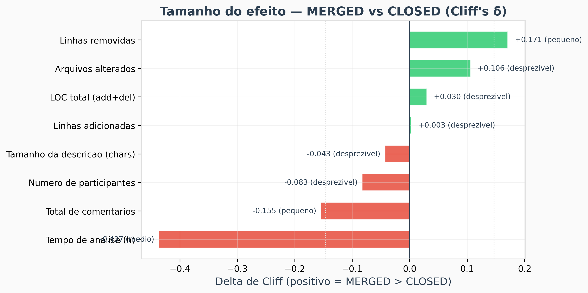

> **Interpretação da Figura 1:** Cada barra horizontal representa uma métrica. O comprimento da barra mostra **o quanto** essa métrica diferencia PRs aceitos (`MERGED`) de rejeitados (`CLOSED`). Barras verdes apontam para a direita quando o valor é maior em `MERGED`; barras vermelhas apontam para a esquerda quando é maior em `CLOSED`. A leitura principal é simples: **apenas o tempo de análise apresenta uma barra grande** (δ = −0,437, efeito médio), significando que se pegarmos um PR aceito e um rejeitado aleatoriamente, em cerca de 72% das vezes o rejeitado terá ficado aberto por mais tempo. Todas as outras métricas têm barras curtas (efeito desprezível), ou seja, saber o tamanho, a descrição ou o número de participantes de um PR praticamente não ajuda a adivinhar se ele será aceito ou rejeitado. As linhas pontilhadas verticais marcam os limites do efeito desprezível (|δ| < 0,147): barras que ficam dentro dessa faixa são consideradas insignificantes na prática.

**Figura 2** — Distribuição do tempo de análise por *status* (violino comparativo).
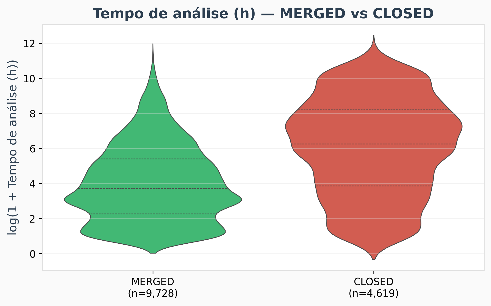

> **Interpretação da Figura 2:** Cada "violino" mostra como os tempos de análise se distribuem dentro de cada grupo. Onde o violino é **mais largo**, há mais PRs com aquele tempo; onde é **mais fino**, há poucos. A linha tracejada no meio de cada violino marca a **mediana** (o valor do meio). Observa-se que: (1) o violino verde (`MERGED`) é mais gordo em baixo, indicando que a maioria dos PRs aceitos é resolvida rapidamente — metade em menos de 41 horas (~1,7 dias); (2) o violino vermelho (`CLOSED`) é mais gordo em cima e mais largo no geral, mostrando que PRs rejeitados ficam abertos por muito mais tempo — metade leva mais de 520 horas (~21,7 dias). Em termos práticos: **PRs aceitos são resolvidos aproximadamente 13 vezes mais rápido do que os rejeitados**. Curiosamente, o violino de `CLOSED` tem dois "bicos" (bimodal), sugerindo dois perfis: PRs que são rejeitados rápido e PRs que ficam "esquecidos" antes de serem fechados.

**Figura 3** — Função de distribuição acumulada (ECDF) do tempo de análise por *status*.
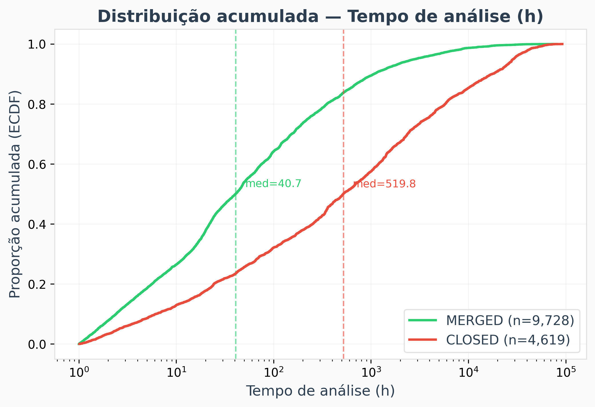

> **Interpretação da Figura 3:** Este gráfico funciona como uma "escada": cada curva sobe de 0% a 100% da esquerda para a direita, mostrando a **porcentagem acumulada de PRs** que já atingiram determinado tempo. As linhas tracejadas verticais marcam a mediana de cada grupo. A leitura prática é: quando a curva verde (`MERGED`) cruza os 50%, o tempo é de apenas **40,7 horas** (~1,7 dias). Já a curva vermelha (`CLOSED`) só cruza os 50% em **519,8 horas** (~21,7 dias). A **distância horizontal entre as duas curvas** mostra o quanto os grupos diferem: quanto maior a separação, mais o tempo ajuda a distinguir aceitos de rejeitados. A separação é máxima na faixa de 40 a 500 horas — essa é a "zona de decisão" onde o tempo é mais informativo. Em resumo: se um PR já está aberto há mais de 500 horas, as chances de ser aceito diminuem consideravelmente.

**Figura 4** — Taxa de `MERGED` por decil de tempo de análise.
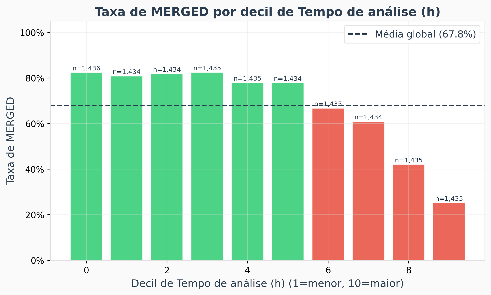

> **Interpretação da Figura 4:** Aqui dividimos todos os PRs em 10 grupos iguais, do mais rápido (decil 1) ao mais lento (decil 10), e mostramos **qual porcentagem de cada grupo foi aceita**. A linha tracejada horizontal mostra a média geral (~68%). A leitura é clara: nos primeiros 6 grupos (PRs mais rápidos), cerca de **80% são aceitos** — bem acima da média. A partir do 7º grupo, a taxa cai drasticamente, e no grupo dos 10% mais lentos, **apenas ~25% são aceitos**. Isso significa que o tempo não tem um efeito gradual, mas sim um **efeito de limiar**: existe uma faixa de tempo após a qual as chances de aceitação despencam. Para um desenvolvedor, a mensagem é direta: **quanto mais rápido o PR for analisado, maior a probabilidade de ser aceito**.

### 9.3 Resultados — Dimensão B (RQ05–RQ08)

| RQ | Métrica | ρ Spearman | IC 95% | *p*-Holm | Interpretação |
|----|---------|-----------|--------|----------|---------------|
| RQ05 | Arquivos alterados | 0,270 | [0,254; 0,285] | < 0,001 | fraca positiva |
| RQ05 | Linhas adicionadas | **0,315** | [0,300; 0,329] | < 0,001 | **moderada positiva** |
| RQ05 | Linhas removidas | 0,183 | [0,168; 0,200] | < 0,001 | fraca positiva |
| RQ05 | LOC total | **0,302** | [0,287; 0,316] | < 0,001 | **moderada positiva** |
| RQ06 | Tempo de análise (h) | 0,110 | [0,094; 0,126] | < 0,001 | fraca positiva |
| RQ07 | Descrição (chars) | 0,185 | [0,169; 0,202] | < 0,001 | fraca positiva |
| RQ08 | Participantes | **0,342** | [0,327; 0,356] | < 0,001 | **moderada positiva** |
| RQ08 | Comentários | **0,330** | [0,315; 0,344] | < 0,001 | **moderada positiva** |

**Figura 5** — Spearman ρ com IC 95% para todas as métricas da Dimensão B.
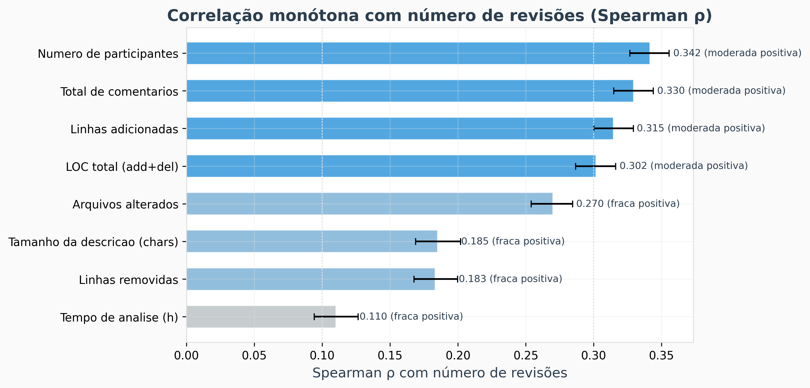

> **Interpretação da Figura 5:** Este gráfico responde à pergunta: "**quais características do PR fazem com que ele receba mais revisões?**" Cada barra mostra o Spearman ρ — uma medida de o quanto a métrica "anda junto" com o número de revisões (quanto mais longa a barra, mais forte a relação). Os traços pretos no final de cada barra mostram o intervalo de confiança (a faixa onde o valor verdadeiro provavelmente está). As quatro métricas mais fortes são: **participantes** (ρ = 0,342), **comentários** (0,330), **linhas adicionadas** (0,315) e **LOC total** (0,302). Em linguagem simples: PRs com mais pessoas envolvidas, mais discussão e mais código alterado tendem a passar por mais ciclos de revisão. Um achado importante: o **tempo de análise**, que era o melhor preditor de aceitação/rejeição (Figura 1), é o **pior preditor do número de revisões** (ρ = 0,110). Isso confirma que aceitação e esforço de revisão são coisas diferentes.

**Figura 6** — Dispersão LOC total × revisões (hexbin, escala log).
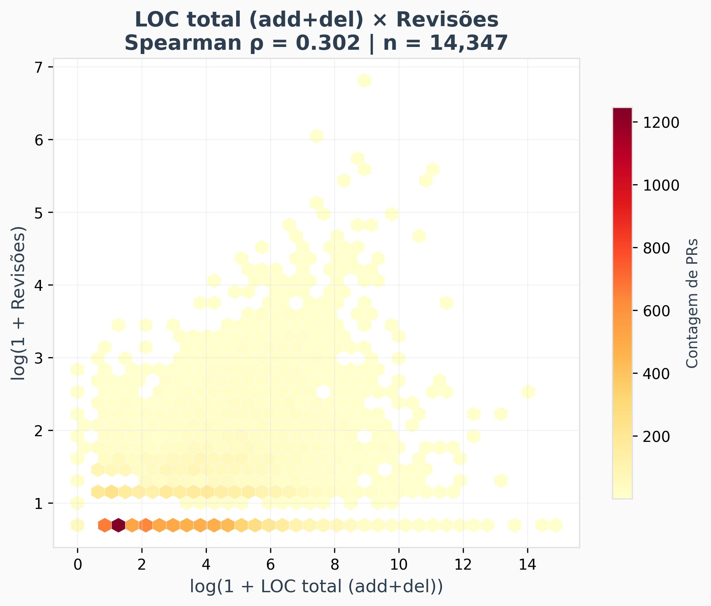

> **Interpretação da Figura 6:** Cada hexágono colorido representa uma "região" do gráfico onde se concentram PRs. **Cores mais escuras (vermelho/laranja) = muitos PRs ali; cores claras (amarelo) = poucos PRs.** Os eixos usam escala logarítmica para acomodar valores que vão de 1 a centenas de milhares. A concentração de hexágonos escuros no canto inferior esquerdo mostra que a grande maioria dos PRs é pequena (poucas linhas de código) e recebe poucas revisões (1 a 3). Conforme avançamos para a direita (PRs maiores), os hexágonos sobem um pouco, indicando que PRs maiores tendem a receber mais revisões — mas com muita variação. Um PR de 1.000 linhas pode receber 1 revisão ou 50. Essa é a natureza de uma correlação **moderada** (ρ = 0,302): a tendência existe, mas não é uma regra rígida.

**Figura 7** — Dispersão comentários × revisões (hexbin, escala log).
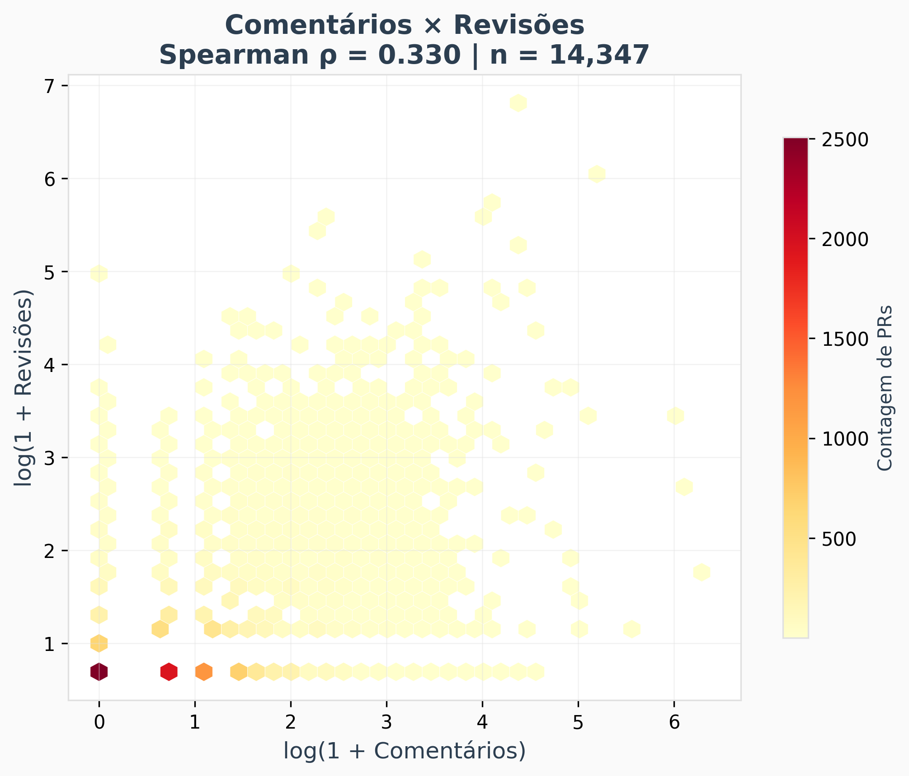

> **Interpretação da Figura 7:** Comparando com a Figura 6, nota-se que aqui a "nuvem" de hexágonos sobe de forma mais acentuada — a diagonal é mais clara. Isso significa que a relação entre comentários e revisões é **mais forte** do que a relação entre tamanho e revisões (ρ = 0,330 vs. 0,302). Esse resultado faz sentido intuitivo: comentários e revisões são formas de interação entre as pessoas. Quando um PR gera muito debate (muitos comentários), é natural que ele também passe por mais ciclos de revisão, pois os revisores pedem mudanças, o autor responde, e o processo se repete. A grande concentração de hexágonos escuros na base (0–1 comentário, 1 revisão) revela que **a maioria dos PRs é simples e aceita sem discussão** — o que é esperado em projetos maduros.

**Figura 8** — Distribuição de revisões por quartil de LOC total.
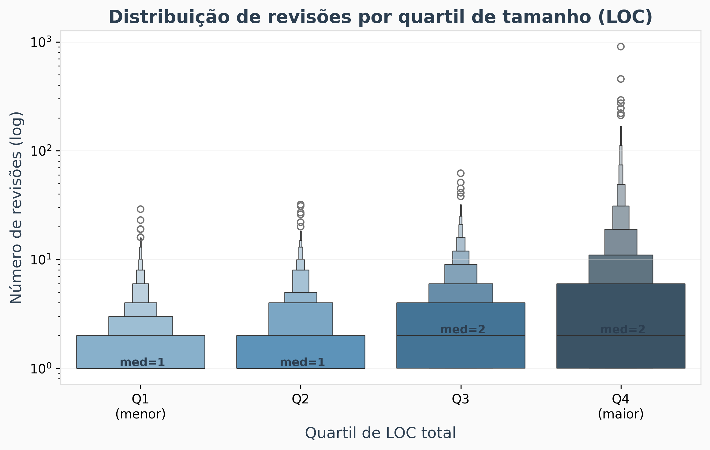

> **Interpretação da Figura 8:** Aqui, os PRs foram divididos em 4 grupos de tamanho igual: Q1 (25% menores), Q2, Q3 e Q4 (25% maiores). Para cada grupo, o gráfico mostra como se distribui o número de revisões. A leitura é direta: **conforme os PRs ficam maiores (da esquerda para a direita), a "caixa" sobe**, indicando que PRs maiores recebem mais revisões. Além disso, nos grupos Q3 e Q4, a cauda superior (PRs com muitas revisões) é **muito mais longa**, o que significa que PRs grandes não apenas recebem mais revisões em média, como também são mais **imprevisíveis** — alguns são revisados rapidamente, outros passam por dezenas de ciclos. Para um desenvolvedor, a lição prática é: **PRs pequenos reduzem tanto o número de revisões quanto a incerteza do processo**.

---

## 10. Discussão e Interpretação

### 10.1 Confronto questão a questão

**RQ01 — Tamanho × *feedback* final:** As medianas de LOC total são essencialmente idênticas entre os grupos (34 em `MERGED` vs. 31 em `CLOSED`), com δ de Cliff desprezível (+0,03). **Hipótese refutada.** O tamanho do PR, isoladamente, não prediz o desfecho.

**RQ02 — Tempo de análise × *feedback* final:** A mediana do tempo em `MERGED` (40,7 h) é aproximadamente **13 vezes menor** que em `CLOSED` (519,8 h). O δ de Cliff (−0,437) configura o efeito mais forte observado. **Hipótese corroborada.**

**RQ03 — Descrição × *feedback* final:** A mediana da descrição é maior em `CLOSED` (843 chars) do que em `MERGED` (698 chars), com efeito desprezível. **Hipótese refutada.** Descrições longas tendem a acompanhar PRs controversos.

**RQ04 — Interações × *feedback* final:** Comentários apresentam mediana maior em `CLOSED` (2 vs. 1), com efeito pequeno (δ = −0,155). Participantes não diferenciaram os grupos. **Hipótese parcialmente corroborada.**

**RQ05 — Tamanho × revisões:** LOC total apresenta ρ = 0,302 (moderada positiva). **Hipótese corroborada.** O tamanho não prediz o desfecho (RQ01), mas prediz o esforço de revisão.

**RQ06 — Tempo × revisões:** ρ = 0,110 (fraca positiva). **Hipótese corroborada com efeito fraco.** Um PR pode permanecer aberto sem novas revisões.

**RQ07 — Descrição × revisões:** ρ = 0,185 (fraca positiva, contrária à expectativa). **Hipótese refutada.** Descrições longas acompanham PRs complexos que demandam mais revisões.

**RQ08 — Interações × revisões:** ρ = 0,342 (participantes) e 0,330 (comentários), ambos moderada positiva. **Hipótese corroborada.**

### 10.2 Comparação cruzada (Dimensão A vs. Dimensão B)

| Categoria | δ Cliff (Dim. A) | ρ Spearman (Dim. B) | Leitura |
|-----------|-----------------|---------------------|---------|
| Tamanho (LOC) | +0,030 (desprezível) | +0,302 (moderada) | Não prediz desfecho; prediz esforço |
| Tempo | **−0,437 (médio)** | +0,110 (fraca) | Prediz desfecho mais que esforço |
| Descrição | −0,043 (desprezível) | +0,185 (fraca) | Pouca influência em ambas |
| Interações | −0,155 (pequeno) | +0,330 (moderada) | Mais comentários → `CLOSED` e mais revisões |

**Figura 9** — Cruzamento das duas dimensões: efeito no desfecho (δ) vs. efeito no esforço (ρ).
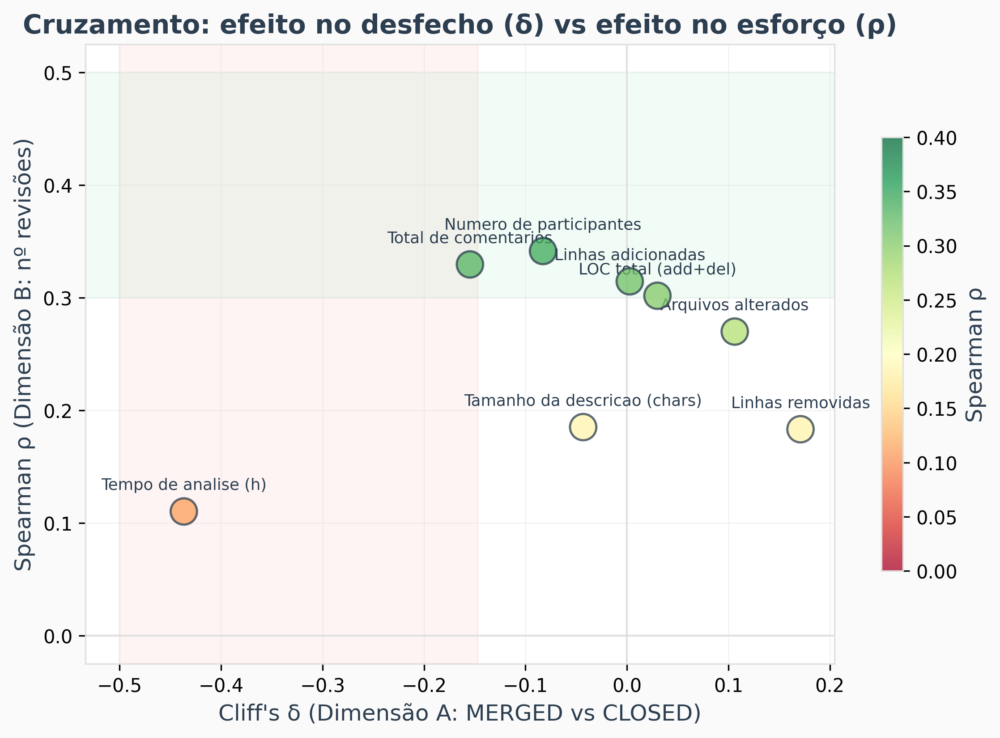

> **Interpretação da Figura 9:** Este gráfico é o mais importante do relatório, pois **cruza as duas perguntas centrais do estudo em uma única imagem**. O eixo horizontal (X) mostra o quanto cada métrica influencia a aceitação/rejeição do PR (δ de Cliff — quanto mais à esquerda, mais associada a `CLOSED`). O eixo vertical (Y) mostra o quanto cada métrica influencia o número de revisões (ρ de Spearman — quanto mais acima, mais revisões). A leitura por posição é: **Canto inferior esquerdo** (tempo de análise): é o campeão em prever aceitação, mas quase não prevê esforço. **Parte superior central** (participantes, comentários): são os campeões em prever esforço, com impacto modesto na aceitação. **Parte superior direita** (LOC, adições, arquivos): preveem esforço de revisão, mas não a aceitação. **Centro** (descrição): influência fraca em tudo. A conclusão visual é que **nenhuma métrica é "boa em tudo" ao mesmo tempo** — aceitar e revisar são processos governados por fatores diferentes.

**Figura 10** — Matriz de correlação de Spearman entre todas as variáveis.
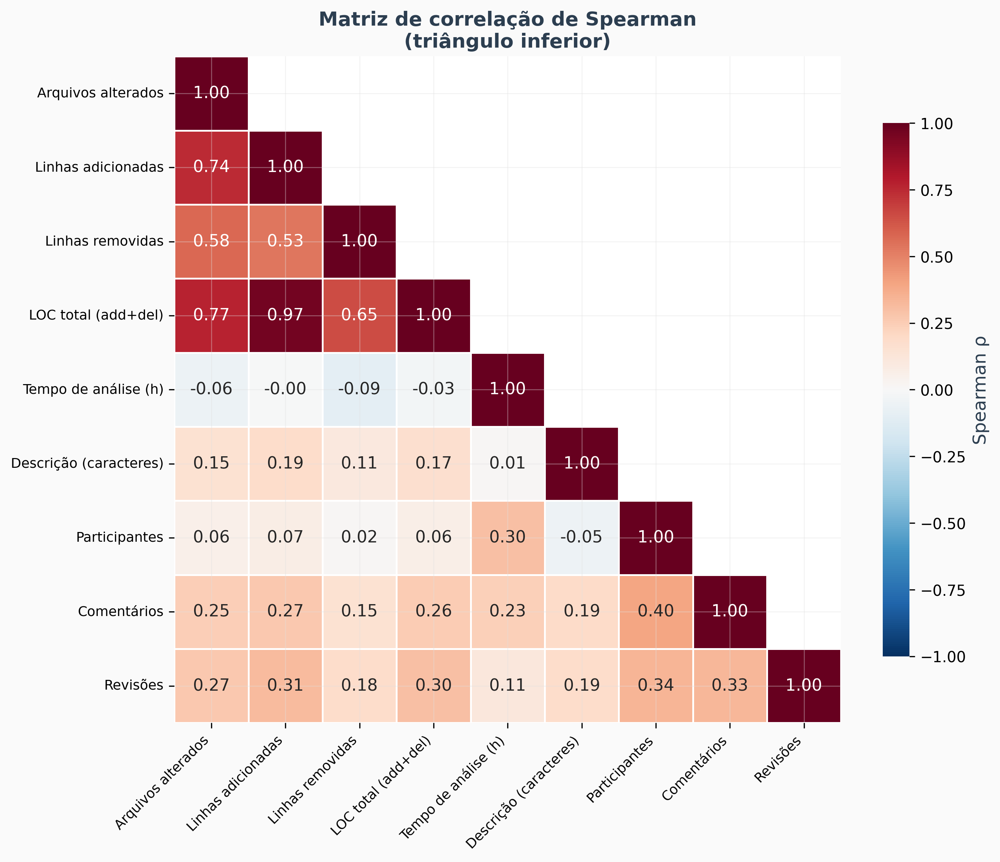

> **Interpretação da Figura 10:** Esta matriz mostra como **todas as variáveis se relacionam entre si**. Cada célula exibe o ρ de Spearman entre duas variáveis: **tons escuros de vermelho = forte relação positiva** (quando uma sobe, a outra também sobe); **tons claros/brancos = sem relação**. Observam-se dois "blocos" de destaque: (1) **Bloco de tamanho** (canto superior esquerdo): linhas adicionadas, LOC total e arquivos alterados são fortemente relacionados entre si (ρ > 0,74). Isso é esperado — se um PR adiciona muitas linhas, provavelmente mexe em muitos arquivos. Na prática, essas métricas são parcialmente redundantes. (2) **Bloco de interação**: participantes e comentários têm ρ = 0,40 — PRs com mais gente envolvida geram mais discussão. O achado mais revelador é que o **tempo de análise** (5ª linha) tem valores próximos de zero com quase tudo. Isso significa que o tempo de um PR **não depende do seu tamanho** — um PR pequeno pode ficar aberto por meses, e um grande pode ser resolvido em horas. É uma informação independente e complementar.

### 10.3 Limitações (ameaças à validade)

- ***Snapshot* temporal único** (30/04/2026): tendências do ecossistema podem mudar.
- **Viés de popularidade:** a amostragem dos 200 repositórios mais estrelados exclui projetos menores.
- **Heurística de 1 hora:** pode falhar em *bots* lentos ou PRs legítimos rápidos.
- **Subamostragem:** até 100 PRs validados por repositório para projetos de altíssimo volume.
- **Confundimento:** testes univariados não isolam efeitos cofundidos; análise multivariada é trabalho futuro.

### 10.4 Comparação com a literatura

- **Gousios, Pinzger e van Deursen (2014):** corroboramos parcialmente a importância do tempo; contestamos a centralidade da descrição.
- **Tsay, Dabbish e Herbsleb (2014):** corroboramos a importância dos fatores sociais (interações/comentários).
- **Yu *et al.* (2015):** corroboramos o efeito do tamanho sobre o esforço; contestamos a centralidade da descrição.
- **Kononenko, Baysal e Godfrey (2016):** complementamos o modelo misto (técnico + social) em escala agregada.

---

## 11. Conclusão e Recomendações

### 11.1 Decisões práticas

- **Para maximizar aceitação:** priorizar PRs que possam ser fechados rapidamente. A mediana de `MERGED` é 40,7 h contra 519,8 h dos `CLOSED`.
- **Para reduzir esforço de revisão:** manter PRs menores em LOC e reduzir ciclos de discussão.
- **Quanto à descrição:** boa prática, mas o ganho objetivo nas métricas agregadas é discreto.

### 11.2 Sugestões para trabalhos futuros

- Regressão logística para `status` e Binomial Negativa para `numero_reviews`.
- Segmentação por linguagem, domínio e maturidade do repositório.
- Inclusão de métricas de CI/CD (*checks*, presença de *bots*).
- Estudo longitudinal por repositório.

### 11.3 Resultado conclusivo

Em uma amostra de **14.347 PRs** distribuídos por **182 repositórios populares**, o **tempo de análise** mostrou-se o preditor mais forte do desfecho (δ = −0,44, efeito médio). Os melhores preditores do **esforço de revisão** são as **interações** (ρ ≈ 0,33) e o **tamanho** (ρ ≈ 0,30). O tamanho não prediz o desfecho, e a descrição apresenta influência apenas marginal em ambas as dimensões.

---

## 12. Reprodutibilidade

```bash
# 1. Coleta (≈90 min)
python scripts/coleta_graphql_PRs.py

# 2. Enriquecimento (≈25 min)
python scripts/enriquecer_participantes.py

# 3. Análise estatística
python scripts/analise_sprint3.py

# 4. Gráficos aprimorados
python scripts/graficos_aprimorados.py
```

**Dados:** `output/lab3s2/pull_requests_com_reviews.csv`  
**Resultados:** `output/lab3s3/`  
**Gráficos:** `output/lab3s3/charts_v2/`

---

## 13. Painel Resumo

**Figura 11** — Dashboard consolidado dos achados do estudo.
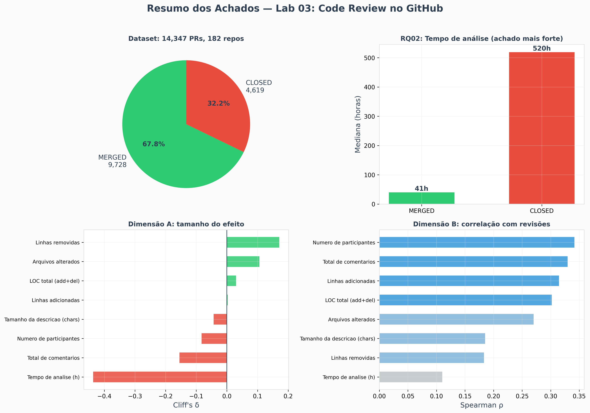

> **Interpretação da Figura 11:** Este painel resume o estudo inteiro em quatro gráficos. **Canto superior esquerdo (pizza):** mostra que o *dataset* é composto por 67,8% de PRs aceitos e 32,2% rejeitados, ou seja, há exemplos suficientes de ambos os grupos para fazer comparações confiáveis. **Canto superior direito (barras):** é o achado mais forte — a barra vermelha (`CLOSED`, 520 horas) é quase **13 vezes mais alta** que a verde (`MERGED`, 41 horas), mostrando visualmente que PRs rejeitados demoram muito mais. **Canto inferior esquerdo:** resume quais métricas diferenciam aceitos de rejeitados (o tempo domina). **Canto inferior direito:** resume quais métricas estão associadas a mais revisões (interações e tamanho lideram). Se você puder mostrar apenas um gráfico na apresentação, escolha este.

**Figura 12** — Distribuições comparativas por status para todas as métricas.
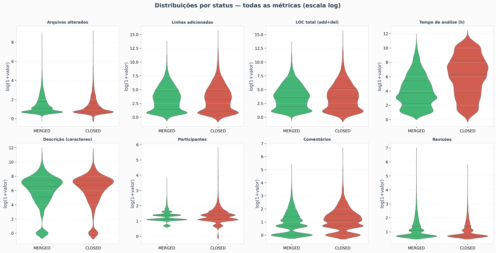

> **Interpretação da Figura 12:** Cada sub-gráfico compara a distribuição de uma métrica entre PRs aceitos (verde) e rejeitados (vermelho). A observação mais importante é que **quase todos os pares de violinos são praticamente idênticos** em formato e posição, exceto o do **tempo de análise**, onde a diferença é visível. Isso confirma de forma visual o que os números já mostraram: se você olhar apenas o tamanho, a descrição ou o número de participantes de um PR, não conseguirá dizer se ele foi aceito ou rejeitado — os dois grupos são "parecidos demais". Somente o tempo fornece uma distinção clara e inequívoca.

**Figura 13** — Medianas MERGED vs. CLOSED para métricas selecionadas.
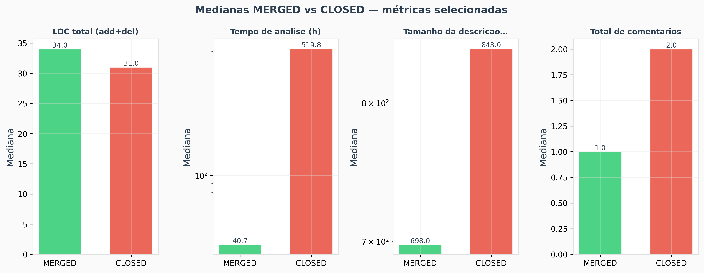

> **Interpretação da Figura 13:** Este gráfico coloca lado a lado as medianas de `MERGED` (verde) e `CLOSED` (vermelho) para quatro métricas selecionadas. A comparação é visual e imediata: no **tempo de análise**, a barra vermelha é enormemente maior que a verde — a diferença é gritante. Já nas outras três métricas (LOC total, comentários e descrição), as barras verde e vermelha têm alturas muito parecidas, confirmando que essas variáveis não distinguem bem os dois grupos. Em termos simples: **o tempo é o "detector" de aceitação; tamanho e descrição não ajudam nessa tarefa**.

---

## Referências

- GOUSIOS, G.; PINZGER, M.; VAN DEURSEN, A. An Exploratory Study of the Pull-based Software Development Model. In: *ICSE*, 2014. DOI: 10.1145/2568225.2568260.
- TSAY, J.; DABBISH, L.; HERBSLEB, J. Influence of Social and Technical Factors for Evaluating Contribution in GitHub. In: *ICSE*, 2014. DOI: 10.1145/2568225.2568315.
- YU, Y.; WANG, H.; FILKOV, V.; DEVANBU, P.; VASILESCU, B. Wait for It: Determinants of Pull Request Evaluation Latency on GitHub. In: *MSR*, 2015. DOI: 10.1109/MSR.2015.42.
- KONONENKO, O.; BAYSAL, O.; GODFREY, M. W. Code Review Quality: How Developers See It. In: *ICSE*, 2016. DOI: 10.1145/2884781.2884840.
