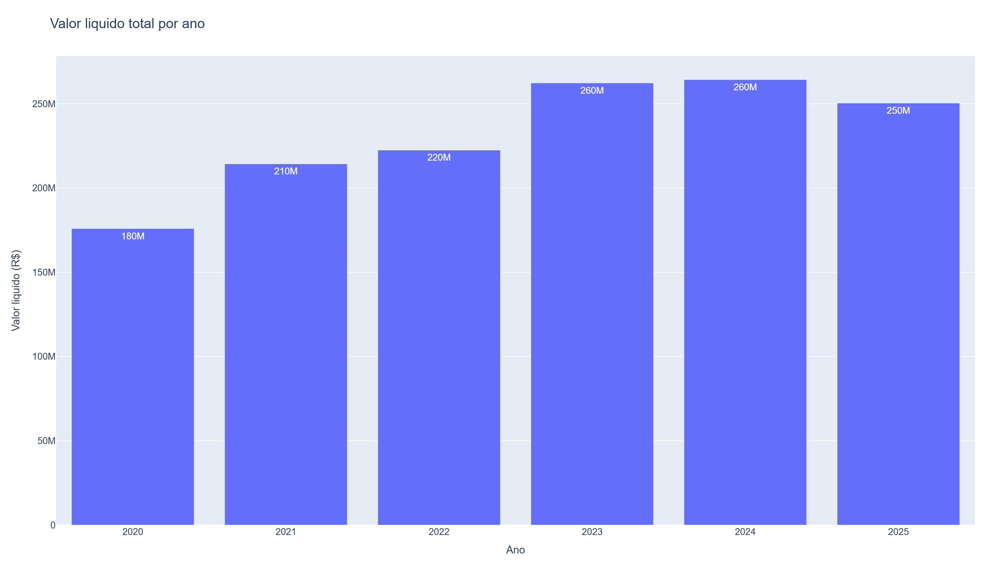
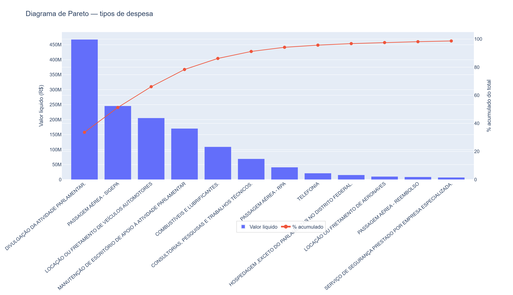
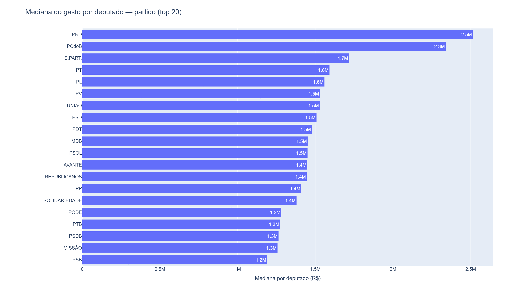
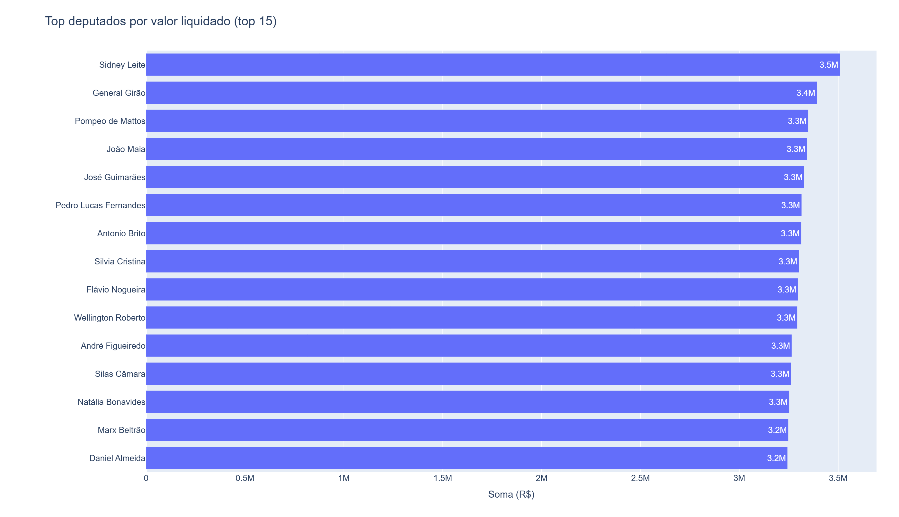
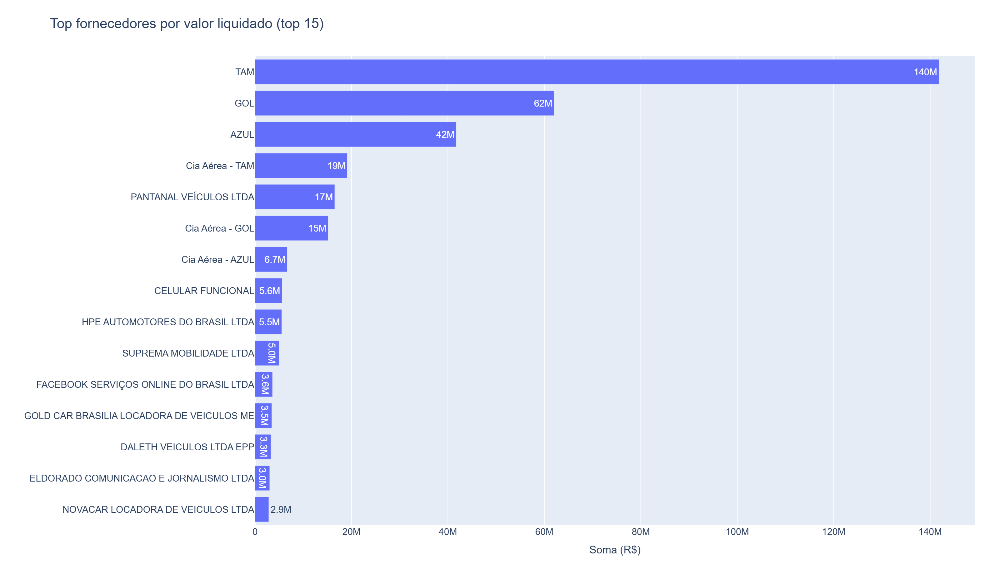

# Relatório Final — Laboratório 04 (Sprint 03)

## Visualização de Dados Abertos Governamentais: Despesas da CEAP na Câmara dos Deputados

---

**Disciplina:** Laboratório de Experimentação de Software  
**Curso:** Engenharia de Software  
**Professor:** João Paulo Carneiro Aramuni  
**Autores:** *(preencher nomes dos integrantes)*  
**Data:** 28 de maio de 2026  
**Repositório:** [github.com/Miguel-Lessa/lab-medicao](https://github.com/Miguel-Lessa/lab-medicao) — pasta `laboratorio4/`

---

## Resumo

Este relatório documenta um experimento de Business Intelligence aplicado à **Cota para Exercício da Atividade Parlamentar (CEAP)**, base pública da Câmara dos Deputados. Foram coletados e tratados **1.271.817 lançamentos** (competência 2020–2025), totalizando **R$ 1.389.844.978,70** em valor líquido ressarcido. Um dashboard interativo (Streamlit + Plotly) responde a três questões de pesquisa; neste documento são apresentadas **5 figuras essenciais** (apresentação rápida), cada uma com explicação objetiva. Os resultados indicam forte concentração em divulgação parlamentar e passagens aéreas (~51% do total nas duas primeiras categorias), diferença entre rankings por **soma total** e por **mediana por deputado** em partidos/UFs, e domínio de companhias aéreas entre fornecedores. A análise é **descritiva e exploratória**, sem inferência de irregularidades.

---

## 1. Introdução

### 1.1 Contextualização

Business Intelligence (BI) transforma grandes volumes de dados operacionais em informação para decisão. No setor público brasileiro, portais de **dados abertos** — como o da [Câmara dos Deputados](https://dadosabertos.camara.leg.br/) — permitem auditoria social e pesquisa sobre uso de recursos parlamentares. A CEAP cobre despesas de exercício da atividade parlamentar (deslocamentos, divulgação, manutenção de escritório, entre outras), sendo uma das bases mais utilizadas em jornalismo de dados e estudos de transparência.

O Laboratório 04 da disciplina solicita a construção de um **dashboard autoexplicativo** com (i) **caracterização do dataset** e (ii) **visualizações que respondam a questões de pesquisa**, com métricas e rótulos adequados. Como trabalho alternativo (sem vínculo com TIS 6), adotou-se base governamental pública e relatório com introdução, metodologia, resultados e discussão.

### 1.2 Problema foco do experimento

**Como visualizar e explorar de forma clara, reprodutível e comparável os padrões de gastos da CEAP entre 2020 e 2025, permitindo identificar concentrações por categoria, diferenças entre grupos políticos e geográficos, e os maiores valores por parlamentar e fornecedor?**

O problema não é detectar fraude automaticamente, e sim **organizar e comunicar** os dados para que cidadãos, pesquisadores e gestores compreendam *onde*, *quando* e *em que categorias* os recursos se concentram.

### 1.3 Questões de pesquisa

| ID | Questão de pesquisa |
|----|---------------------|
| **RQ1** | Quais tipos de despesa concentram mais gastos parlamentares? |
| **RQ2** | Como os gastos variam por partido e por UF? |
| **RQ3** | Quais deputados e fornecedores concentram os maiores valores? |

### 1.4 Hipóteses

As hipóteses abaixo orientam a análise exploratória (não foram testadas inferencialmente neste laboratório):

| ID | Hipótese |
|----|----------|
| **H1** | Poucas categorias de despesa concentram a maior parte do valor líquido total (padrão de Pareto). |
| **H2** | Partidos com maiores bancadas aparecem no topo do ranking por **soma total**, mas não necessariamente por **mediana de gasto por deputado**. |
| **H3** | UFs mais populosas lideram em **volume absoluto**, porém UFs menores podem apresentar **mediana por deputado** semelhante ou superior. |
| **H4** | Fornecedores do setor aéreo e de mídia/divulgação dominam os maiores valores agregados no período. |
| **H5** | O valor por lançamento é fortemente assimétrico (muitos lançamentos de baixo valor e cauda longa de valores altos). |

### 1.5 Objetivos

**Objetivo geral:** Produzir um dashboard e relatório de BI sobre a CEAP (2020–2025) que caracterize o dataset e respondam às RQ1–RQ3 com visualizações adequadas e exportáveis.

**Objetivos específicos:**

1. Coletar e tratar automaticamente os CSV anuais publicados pela Câmara.
2. Caracterizar volume, cobertura temporal, cardinalidade e distribuição dos valores.
3. Implementar visualizações por tipo de despesa, partido, UF, deputado e fornecedor.
4. Comparar métricas de **soma** e **mediana por deputado** para evitar viés de tamanho de grupo.
5. Disponibilizar exportação de gráficos (PNG/HTML) para inclusão em relatório e PDF.

---

## 2. Metodologia

### 2.1 Passo a passo do experimento

```text
1. Definição do recorte (CEAP, anos 2020–2025) e das RQ1–RQ3
2. Coleta automatizada dos ZIPs anuais (script coleta_ceap.py)
3. Extração e consolidação dos CSVs brutos
4. Tratamento e padronização (script prepara_dados.py)
5. Geração da base analítica: output/despesas_ceap_tratadas.csv
6. Desenvolvimento do dashboard Streamlit (app/dashboard.py)
7. Exploração interativa com filtros (ano, mês, partido, UF, tipo, deputado)
8. Exportação das figuras para o relatório (scripts/exportar_figuras_relatorio.py)
9. Redação do relatório com interpretação alinhada ao enunciado do Lab04
```

### 2.2 Decisões metodológicas

| Decisão | Justificativa |
|---------|---------------|
| **Ferramenta:** Python (Streamlit + Plotly) em vez de Power BI/Tableau | Reprodutibilidade, versionamento no Git e integração com scripts de coleta/tratamento. Atende ao **trabalho alternativo** do enunciado. |
| **Métrica principal:** `valor_liquido` | Valor efetivamente considerado após glosa; padrão em análises da CEAP. |
| **Tempo:** ano/mês de **competência** (`data_referencia`) | A data de emissão do documento pode não coincidir com o período de ressarcimento. |
| **Duas agregações em RQ2:** soma total e mediana por deputado | Soma reflete tamanho do grupo; mediana aproxima comparação “por parlamentar”. |
| **Heatmap em % por partido** | Mostra *composição* do gasto, não apenas volume bruto. |
| **Pizza com fatia “Outros”** | Evita gráfico parcial que não soma 100%. |
| **Exclusão opcional de lideranças (LID/LIDER)** | Estruturas partidárias não são deputados individuais; filtro no dashboard. |

### 2.3 Materiais utilizados

| Material | Descrição |
|----------|-----------|
| Dados brutos | `Ano-2020.csv` … `Ano-2025.csv` em `laboratorio4/data/raw/` |
| Dados tratados | `laboratorio4/output/despesas_ceap_tratadas.csv` |
| Scripts | `coleta_ceap.py`, `prepara_dados.py`, `exportar_figuras_relatorio.py` |
| Dashboard | `laboratorio4/app/dashboard.py` |
| Figuras do relatório | `laboratorio4/relatorios/figuras/*.png` |
| Dependências | `pandas`, `plotly`, `streamlit`, `requests`, `kaleido` |

**Fonte oficial:** [Portal de Dados Abertos — Câmara dos Deputados](https://dadosabertos.camara.leg.br/) · Arquivos CEAP: `http://www.camara.leg.br/cotas/Ano-{ano}.csv.zip`

### 2.4 Métodos utilizados

- **Coleta:** download HTTP dos ZIPs anuais e extração local.
- **ETL:** renomeação de colunas, parsing de valores monetários (formato BR), datas, campos derivados (`ano_mes`, `data_referencia`, flag `eh_lideranca`).
- **Agregação:** `groupby` com soma, contagem, mediana e percentuais.
- **Visualização:** barras horizontais, linhas temporais, histograma, diagrama de Pareto, pizza, boxplot, heatmap (Plotly).
- **Interação:** filtros multiselect no Streamlit; exportação PNG/HTML por gráfico.

### 2.5 Métricas e unidades

| Métrica | Definição | Unidade | Uso principal |
|---------|-----------|---------|---------------|
| Valor líquido | `vlrLiquido` após tratamento | R$ (BRL) | Todas as RQs |
| Registros | Contagem de lançamentos | inteiro | Caracterização |
| Deputados distintos | `nunique(deputado)` | inteiro | Caracterização; base da mediana em RQ2 |
| Mediana por lançamento | Mediana de `valor_liquido` onde valor > 0 | R$ | Caracterização (H5) |
| Mediana por deputado (grupo) | Mediana da soma por deputado dentro de partido/UF | R$ | RQ2 (comparação justa) |
| Percentual / Pareto | Participação e % acumulado por tipo | % | RQ1 (H1) |
| Composição partido × tipo | % da soma do partido em cada tipo | % | RQ2 (heatmap) |

---

## 3. Caracterização do dataset

### 3.1 Visão geral (período completo 2020–2025)

| Indicador | Valor |
|-----------|------:|
| Lançamentos | 1.271.817 |
| Valor líquido total | R$ 1.389.844.978,70 |
| Nomes distintos (deputado/estrutura) | 927 |
| Partidos | 27 |
| UFs / categorias territoriais | 28 |
| Fornecedores distintos | 67.783 |
| Mediana por lançamento (valor > 0) | R$ 259,10 |
| Média por lançamento (valor > 0) | R$ 1.130,98 |
| Percentil 95 por lançamento | R$ 5.000,00 |
| Lançamentos com valor zero | 42.927 |

A competência observada estende-se de **janeiro/2020 a dezembro/2025**. O número de **927** nomes acumula mandatos, trocas de identificação e estruturas como `LID.GOV-CD` e lideranças partidárias; por ano, há entre **554 e 800** nomes distintos.

### 3.2 Caracterização por ano (subgrupo temporal)

| Ano | Registros | Valor líquido (R$) | Deputados distintos |
|-----|----------:|-------------------:|--------------------:|
| 2020 | 166.786 | 175.930.552,00 | 554 |
| 2021 | 218.439 | 214.353.823,00 | 582 |
| 2022 | 209.227 | 222.512.800,00 | 572 |
| 2023 | 236.772 | 262.336.900,00 | 800 |
| 2024 | 232.259 | 264.320.800,00 | 594 |
| 2025 | 208.334 | 250.390.000,00 | 574 |

Há crescimento do **valor total anual** ao longo do período (com exceção de 2025 ligeiramente abaixo de 2024 em valor, mantendo volume elevado de lançamentos). O pico de **800** deputados distintos em 2023 pode refletir mudanças de cadastro ou maior granularidade de registros naquele ano.

### 3.3 Figura de caracterização (única no relatório)

Os demais indicadores da Seção 3.1–3.2 permanecem em **tabelas** para leitura rápida. Evolução mensal, histograma e demais visuais estão no dashboard (`app/dashboard.py`).

---

## 4. Visualização dos resultados (5 figuras)

**Roteiro sugerido (~5 min):** (1) escopo da base → (2) concentração por tipo → (3) comparação justa entre partidos → (4–5) rankings de deputados e fornecedores. Demais análises ficam no dashboard se o professor perguntar.

#### Figura 1 — Valor líquido total por ano (caracterização)



**O que mostra:** barras com a **soma anual** do `valor_liquido` (competência 2020–2025). **Eixo X:** ano; **Eixo Y:** R$.

**Mensagem em uma frase:** o gasto agregado da CEAP **cresceu** de ~R$ 176 mi (2020) para ~R$ 264 mi (2024) e permanece alto em 2025 (~R$ 250 mi) — o dataset cobre um período de volume crescente, base para as RQs.

**Apoio textual (sem gráfico):** mediana por lançamento = **R$ 259**; média = **R$ 1.131** (distribuição assimétrica, **H5**).

---

### 4.1 RQ1 — Tipos de despesa (Figura 2)

| Top 3 categorias | % do total |
|------------------|----------:|
| Divulgação da atividade parlamentar | 33,6% |
| Passagem aérea (SIGEPA) | 17,7% |
| Locação/fretamento de veículos | 14,8% |

As **cinco primeiras** categorias ≈ **86%** do total (**H1** corroborada).

#### Figura 2 — Pareto dos tipos de despesa



**O que mostra:** **barras** = valor líquido por tipo (eixo esquerdo, R$); **linha laranja** = % acumulado do total (eixo direito).

**Mensagem em uma frase:** poucas rubricas (divulgação, passagens, veículos, escritório, combustível) explicam quase todo o **R$ 1,39 bi** — resposta direta à **RQ1**.

**Leitura rápida:** quando a linha passa de ~80%, conte quantas barras existem à esquerda (padrão de concentração).

---

### 4.2 RQ2 — Partido e UF (Figura 3 + tabelas)

**Por soma total (tamanho da bancada):** PL, PT, União, PP, PSD lideram — **não** use só isso para comparar partidos.

**Por mediana por deputado (top 3):** PRD (R$ 2,51 mi), PCdoB (R$ 2,34 mi), S.PART. (R$ 1,72 mi) — **PL não lidera** (**H2**).

**Por UF (texto):** SP lidera em soma; **BA** lidera em mediana por deputado (**H3**) — detalhe no dashboard, sem figura neste relatório.

#### Figura 3 — Mediana do gasto por deputado, por partido



**O que mostra:** para cada partido, calcula-se a **soma** do valor líquido de cada deputado (2020–2025) e depois a **mediana** dessas somas. **Eixo Y:** partido; **Eixo X:** mediana em R$.

**Mensagem em uma frase:** compara o gasto do deputado “típico” de cada legenda, **sem** distorcer pelo número de cadeiras — resposta principal da **RQ2** neste relatório.

---

### 4.3 RQ3 — Deputados e fornecedores (Figuras 4 e 5)

**Top 3 deputados (sem lideranças):** Sidney Leite, General Girão, Pompeo de Mattos (~R$ 3,3–3,5 mi no período).

**Top 3 fornecedores:** TAM, GOL, AZUL — alinhado a passagens aéreas (**H4**).

#### Figura 4 — Top deputados por valor liquidado



**O que mostra:** ranking dos **15 deputados** com maior soma de `valor_liquido` (exclui `LID`/`LIDER`). **Eixo Y:** nome; **Eixo X:** total em R$ (2020–2025).

**Mensagem em uma frase:** identifica quem mais movimentou cota no período — **RQ3** e transparência; valores altos **não** significam, por si só, irregularidade.

---

#### Figura 5 — Top fornecedores por valor liquidado



**O que mostra:** os **15 fornecedores** que mais receberam recursos via CEAP (soma de todos os deputados). **Eixo X:** R$.

**Mensagem em uma frase:** o dinheiro da cota **concentra-se em companhias aéreas** (TAM, GOL, AZUL), coerente com a Figura 2 — fecha a narrativa **RQ1 → RQ3**.

> **Demais gráficos** (evolução mensal, pizza, UF, boxplot, heatmap etc.) ficam no dashboard para exploração e defesa de perguntas do professor.

---

## 5. Discussão dos resultados

### 5.1 Confronto com as questões de pesquisa

| RQ | Resposta sintética | Evidência principal |
|----|-------------------|---------------------|
| **RQ1** | Poucos tipos concentram a maior parte dos recursos | Pareto: top 5 ≈ 86%; divulgação (33,6%) + passagens SIGEPA (17,7%) |
| **RQ2** | Há variação relevante por partido e UF; métrica importa | PL/SP lideram em soma; PRD/PCdoB e BA lideram em mediana |
| **RQ3** | Gastos concentrados em fornecedores aéreos e em deputados com alto volume acumulado no período | TAM + GOL + AZUL; top deputados ~R$ 3,3–3,5 mi em 6 anos |

### 5.2 Insights

1. **Concentração estrutural:** a CEAP no recorte analisado é dominada por divulgação, transporte e apoio de escritório — categorias compatíveis com a finalidade da cota, mas que exigem leitura qualitativa para auditoria.
2. **Comparações entre grupos:** usar apenas soma total confunde **tamanho do grupo** com **padrão de gasto por parlamentar**; a mediana por deputado é essencial em RQ2.
3. **Assimetria dos lançamentos:** mediana (R$ 259) muito inferior à média (R$ 1.131) confirma distribuição assimétrica (H5).
4. **Sazonalidade:** a evolução mensal (dashboard) permite investigar picos em trabalhos futuros; a Figura 1 resume o crescimento anual.
5. **Qualidade do dado:** 42,9 mil lançamentos com valor zero e registros de liderança sem partido padronizado exigem filtros explícitos no dashboard.

### 5.3 Comparações e estatísticas

- **Entre anos:** valor total cresce de ~R$ 176 mi (2020) para ~R$ 264 mi (2024), com volume de lançamentos estável entre 208 mil e 237 mil/ano.
- **Entre métricas (RQ2):** correlação visual entre ranking por soma e por mediana é **baixa** (ex.: PL 1º em soma, 5º em mediana; PRD não aparece no top 5 de soma, mas lidera mediana).
- **Dispersão intra-partido:** o boxplot no dashboard mostra variação entre deputados do mesmo partido.

### 5.4 Confronto com trabalhos e literatura (Plus)

| Referência / linha de trabalho | Relação com este experimento |
|--------------------------------|------------------------------|
| **Transparência ativa e LAI** — estudos sobre abertura de dados no Legislativo brasileiro enfatizam que publicar CSV não garante compreensão; visualização e agregação são necessárias (ex.: debates sobre impacto da Transparência Brasil e do Portal da Transparência). | **Corrobora** a escolha de um dashboard narrativo em vez de apenas disponibilizar CSV. |
| **Projetos de jornalismo de dados (Aos Fatos, Operação Serenata de Amor / Rosie etc.)** | Utilizaram CEAP para apontar **concentrações** e **fornecedores recorrentes** — alinhado às nossas RQ1 e RQ3 (**corrobora** padrões de concentração em poucas categorias e em fornecedores de transporte). |
| **Críticas metodológicas em rankings de parlamentares** | Rankings por **soma bruta** sem normalizar mandato, UF ou tempo de casa podem **estigmatizar** sem contexto — **contesta** interpretação simplista do nosso ranking RQ3; reforça necessidade de mediana, filtros e notas de rodapé (incluídas neste relatório). |
| **GQM em experimentação de software (Basili et al.)** | Objetivo de “explorar dados para decisão” mapeado em questões (RQ) e métricas (soma, mediana, %) — **corrobora** estrutura do laboratório. |

**Síntese:** os achados quantitativos são **consistentes** com a literatura prática sobre CEAP (concentração e fornecedores aéreos), mas este trabalho **refina** a comparação partido/UF com mediana por deputado, reduzindo um viés comum em análises públicas superficiais.

---

## 6. Conclusão

### 6.1 Tomada de decisão

Com base no experimento, um gestor público, pesquisador ou cidadão pode:

- **Priorizar auditoria** nas categorias de divulgação e passagens aéreas (maior impacto financeiro).
- **Comparar partidos e UFs** usando **mediana por deputado**, não apenas volume total.
- **Monitorar fornecedores** com maior volume agregado (setor aéreo) como ponto de partida para análise de contratos e notas fiscais.
- **Reproduzir** a análise atualizando os scripts quando novos anos forem publicados.

### 6.2 Sugestões futuras

1. Normalizar gastos por **tempo de mandato** e **distância da capital**.
2. Cruzar CEAP com API de [deputados](https://dadosabertos.camara.leg.br/) (dados biográficos, comissões).
3. Detectar **fornecedores compartilhados** entre deputados (grafos).
4. Incluir testes estatísticos (Kruskal-Wallis entre UFs, por exemplo).
5. Exportar o dashboard inteiro em PDF automatizado (Streamlit → print ou `pdfkit`).

### 6.3 Resultado conclusivo

O Laboratório 04 foi concluído com **pipeline reprodutível**, **dashboard interativo** completo e **5 figuras** neste relatório para apresentação rápida em sala. A CEAP entre 2020 e 2025 apresenta **alta concentração em poucas rubricas**, **diferenças metodológicas entre soma e mediana** nos recortes partidário e geográfico, e **dominância de fornecedores aéreos** nos maiores valores. A entrega atende ao trabalho alternativo (base pública + relatório com introdução, metodologia, resultados e discussão) e está pronta para conversão em PDF e apresentação em sala.

---

## Referências

1. CÂMARA DOS DEPUTADOS. **Dados Abertos — CEAP**. Disponível em: https://dadosabertos.camara.leg.br/. Acesso em: 28 maio 2026.
2. CÂMARA DOS DEPUTADOS. **Dados Abertos — Legislativo** (webservices). Disponível em: https://www2.camara.leg.br/transparencia/dados-abertos/dados-abertos-legislativo. Acesso em: 28 maio 2026.
3. BASILI, V. R.; ROMBACH, H. D.; CALDIERA, G. **Goal Question Metric Paradigm**. Encyclopedia of Software Engineering, 1994.
4. MICHELIN, L. et al. **Serenata de Amor**: experiência de ciência de dados cívica sobre gastos públicos. *Coding Rights* / projeto Rosie, 2016–2019.
5. TRANSPARÊNCIA BRASIL. Publicação e uso de dados abertos no poder público. Materiais institucionais, 2020–2024.

---

## Apêndice A — Como reproduzir figuras e dashboard

```powershell
python laboratorio4/scripts/coleta_ceap.py
python laboratorio4/scripts/prepara_dados.py
python laboratorio4/scripts/exportar_figuras_relatorio.py
streamlit run laboratorio4/app/dashboard.py
```

## Apêndice B — Entregáveis do Lab04 (checklist)

| Item do enunciado | Arquivo / artefato |
|-------------------|-------------------|
| Caracterização do dataset | Seção 3 (tabelas) + **Figura 1** |
| Visualizações RQ1 | Seção 4.1 + **Figura 2** |
| Visualizações RQ2 | Seção 4.2 + **Figura 3** (+ tabelas UF/partido) |
| Visualizações RQ3 | Seção 4.3 + **Figuras 4–5** |
| Dashboard interativo (todos os gráficos) | `app/dashboard.py` |
| Relatório (apresentação rápida) | Este documento — **5 figuras** |
| Figuras exportadas | `relatorios/figuras/*.png` |

### Índice das 5 figuras deste relatório

| Figura | Arquivo | Uso na apresentação (~1 min) |
|--------|---------|------------------------------|
| 1 | `01_caract_valor_ano.png` | “Quanto dados temos?” |
| 2 | `07_rq1_pareto.png` | “Onde vai o dinheiro?” (RQ1) |
| 3 | `12_rq2_partido_mediana.png` | “Como comparar partidos?” (RQ2) |
| 4 | `17_rq3_deputados.png` | “Quem mais gastou?” (RQ3) |
| 5 | `18_rq3_fornecedores.png` | “Quem mais recebeu?” (RQ3) |

---

*Relatório gerado para conversão em PDF. Mantenha a pasta `figuras/` no mesmo diretório deste arquivo ao exportar.*
